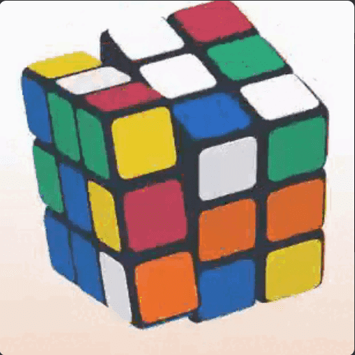

# Rubik NFT

Rubik's NFT 是一种 NFT 形式的互动游戏。玩并尝试在 3D 环境中解决您独特的立方体。

Rubik NFT NFT - 常见问题（FAQ）
▶ 什么是魔方 NFT？
Rubik NFT 是一个 NFT（不可替代代币）集合。存储在区块链上的数字艺术品集合。
▶ 有多少 Rubik NFT 代币？
总共有 666 个 Rubik NFT NFT。目前 570 位所有者的钱包中至少有一个 Rubik NFT NTF。
▶ 最近卖出了多少 Rubik NFT？
过去 30 天内售出 0 个 Rubik NFT NFT。
▶ 有哪些流行的 Rubik NFT 替代品？
许多拥有 Rubik NFT NFT 的用户还拥有 Caked Apes Bakery V2、 The Rogers NFT、 Bitzuki和 Pride Goblins。

