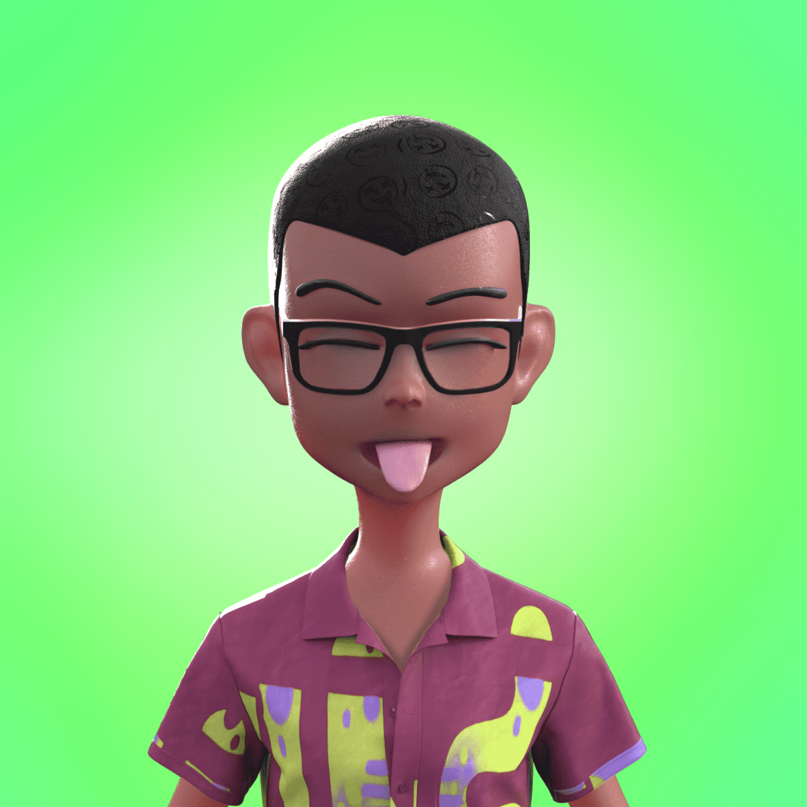

# Rude Kidz (Meta)

Rude Kidz 是一系列时尚的 Kidz，灵感来自我们在操场上最喜欢的童年回忆。他们是不听权威，不怕任何人的麻烦制造者。它们受到高级时尚街头服饰的影响，是与 Kikikickz、BAYC 社区成员、为耐克等服装品牌工作的 3D 设计师和“Rude Kidz”名人合作创建的。The Rude Kidz 将拥有与高端公司和设计师合作设计的实体和数字服装的独家使用权

Rude Kidz 是生活在以太坊区块链上的 7777 粗鲁但非常时尚的 Kidz 的集合。Kidz 由“BAYC Members”创立，是一群年轻而有才华的创新者，他们在时尚、艺术、体育、音乐、电影、金融等领域都表现出色……通过他们对酷炫、高级时尚街头服饰的热爱而走到了一起。

Rude Kidz 将独家获得与著名奢侈和街头服饰品牌合作设计的实体 (IRL) 和数字 (Metaverse) 服装。他们将能够在我们的 Rude Kidz 虚拟世界中与人交流和联系。

他们的游乐场“小巴黎”将由 Chanel 和其他奢侈品牌和项目的历史建筑师 Ramy Fischler 设计，为此目的，我们将成为 Sandbox Metaverse 的元建筑师。我们将围绕时尚、音乐、体育等组织不同的活动……这将是我们策划的独家 NFT 收藏的聚会场所。请继续关注并保持粗鲁的孩子！

