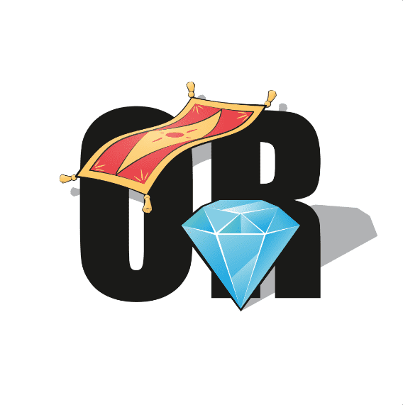

# Rug or Diamond ( DIAMOND COLLECTION )

匿名团队，没有路线图，没有不和谐。

只有 Twitter 和这个糟糕的网络。

这显然只是另一个地毯项目。

简而言之，这是生活在以太坊区块链上的 2000 个 ERC-721 代币的集合。在当前市场的情况下，我们决定薄荷糖是免费的。好消息 - 它很快就会出现。7 月 22 日。关注我们的官方推特以获取更新。

我们是一支由熟练的专业人士组成的团队，每个人都有自己的专业知识。我们总是鼓舞人心并推动变革，我们正在寻找解决方案来构建不同的东西。我们的投资组合中已经有多个成功的项目。

这个计划很简单。创造一个有趣的概念并大肆宣传。保守我们的真实姓名，假装我们是一些大创新者。现在，即使薄荷是免费的，我们也将从二级市场上 7.5% 的特许权使用费中获得所有蜂蜜。经过几天的拖延...... BOOM ......我们走了。

这实际上是我们主要项目的一个实验性预集合。我们暂时保持匿名，不会为您提供明确的路线图或实用程序。但是在铸币之后，我们将展开钻石计划，相信并铸币的人（哎呀）将有一个很大的理由微笑。

