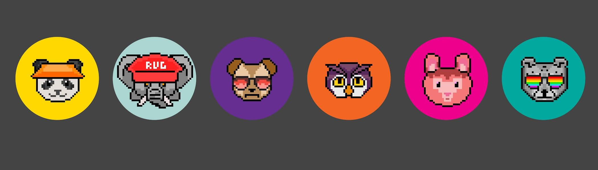

# rugimals PFP

**rugimals PFP 统计**
创建于 5 个月前，1,350 代币供应，7.5% 费用
过去 7 天内没有出售任何 rugimals PFP。

这是 Rugimals 的免费 PFP 版本。Rugimals 是一个独特的动物地毯混搭系列，专门用于那些已经崎岖不平的人。它们是轻松的古怪氛围，灵感来自许多人的共同经历。让我们再次让 NFT 变得有趣。

rugimals PFP NFT - 常见问题（FAQ）

▶ 什么是 rugimals PFP？

rugimals PFP 是一个 NFT（不可替代代币）集合。存储在区块链上的数字艺术品集合。

▶ rugimals PFP 代币有多少？

总共有 1,350 个 rugimals PFP NFT。目前 251 位业主的钱包中至少有一个 rugimals PFP NTF。

▶ 最近卖出了多少 rugimals PFP？

在过去 30 天内售出 0 个 rugimals PFP NFT。

