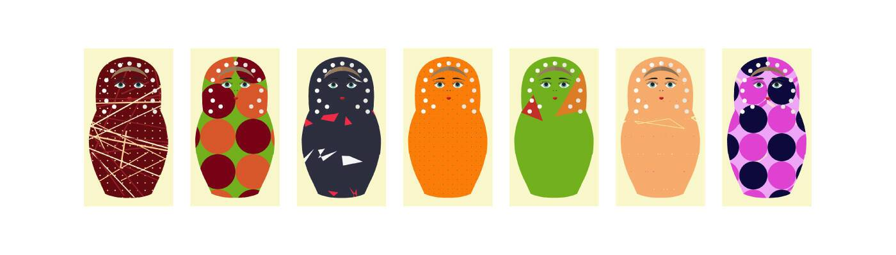

# Russian Dolls Special Edition

# 俄罗斯娃娃统计

创建于 12 个月前，321代币供应，10% 费用

过去 7 天内没有出售任何 AI 俄罗斯娃娃。

一组带有 AI 生成图案的俄罗斯娃娃。俄罗斯娃娃也被称为头巾娃娃、堆叠娃娃或嵌套娃娃。

AI 俄罗斯娃娃 NFT - 常见问题（FAQ）

▶ 什么是 AI 俄罗斯娃娃？

AI Russian Dolls 是一个 NFT（非同质代币）集合。存储在区块链上的数字艺术品集合。

▶ 有多少 AI 俄罗斯娃娃代币？

总共有 321 个 AI 俄罗斯娃娃 NFT。目前，208 位所有者的钱包中至少有一个 AI 俄罗斯娃娃 NTF。

▶ 最近卖出了多少 AI 俄罗斯娃娃？

过去 30 天内共售出 0 个 AI Russian Dolls NFT。

