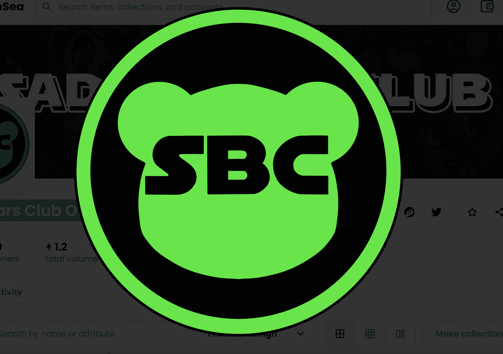

# Sad Bears Club Official

**悲伤熊俱乐部官方统计**

创建于 5 个月前，100 代币供应，7.5% 费用

过去 7 天没有售出 Sad Bears Club Official。

悲伤熊俱乐部官方 NFT - 常见问题（FAQ）

▶ 什么是悲伤熊俱乐部官员？

Sad Bears Club Official 是一个 NFT（不可替代代币）系列。存储在区块链上的数字艺术品集合。

▶ 悲伤熊俱乐部官方代币有多少？

总共有 100 个悲伤熊俱乐部官方 NFT。目前，39 位所有者的钱包中至少有一个悲伤熊俱乐部官方 NTF。

▶ 最近卖出了多少悲伤熊俱乐部官方？

过去 30 天内共售出 0 个 Sad Bears Club 官方 NFT。

