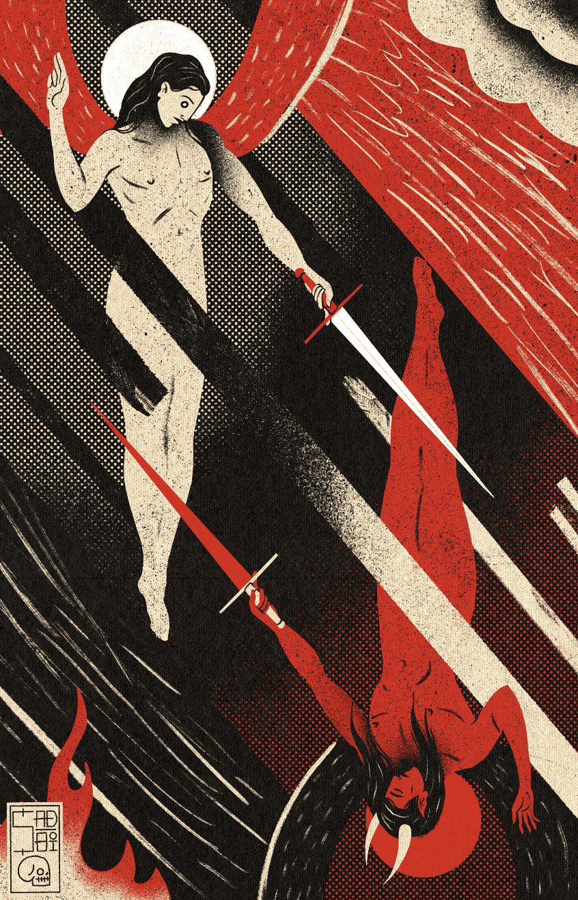

# Sadboi- Editions

**Sadboi-版本统计**

创建于 2 个月前，22 代币供应，10% 费用

过去 7 天内没有售出 Sadboi 版本。

Sadboi 的版本，根据 Manifold 合同铸造。

Sadboi- 版本 NFT - 问题常见（FAQ）
▶ 什么是 Sadboi- 版本？
Sadboi-Editions 是一个 NFT（不可替代代币）集合。存储在区块链上的数字收藏品集合。
▶ 存在多少个Sadboi- Editions 代币？
有伤心-boi-Editions目前，16个有N个位的伤心boi-Editions NTF。
▶ 什么是最昂贵的 Sadboi-Editions 销售？
售出最贵的 Sadboi-Editions NFT 是 Keyboard Goblin #2/10。它于 2022-06-25（2 个月前）以 78.6 美元的价格售出。
▶最近最接近了多少个Sadboi？
过去 30 个悲伤版本 NFT 9 个悲伤版本。

