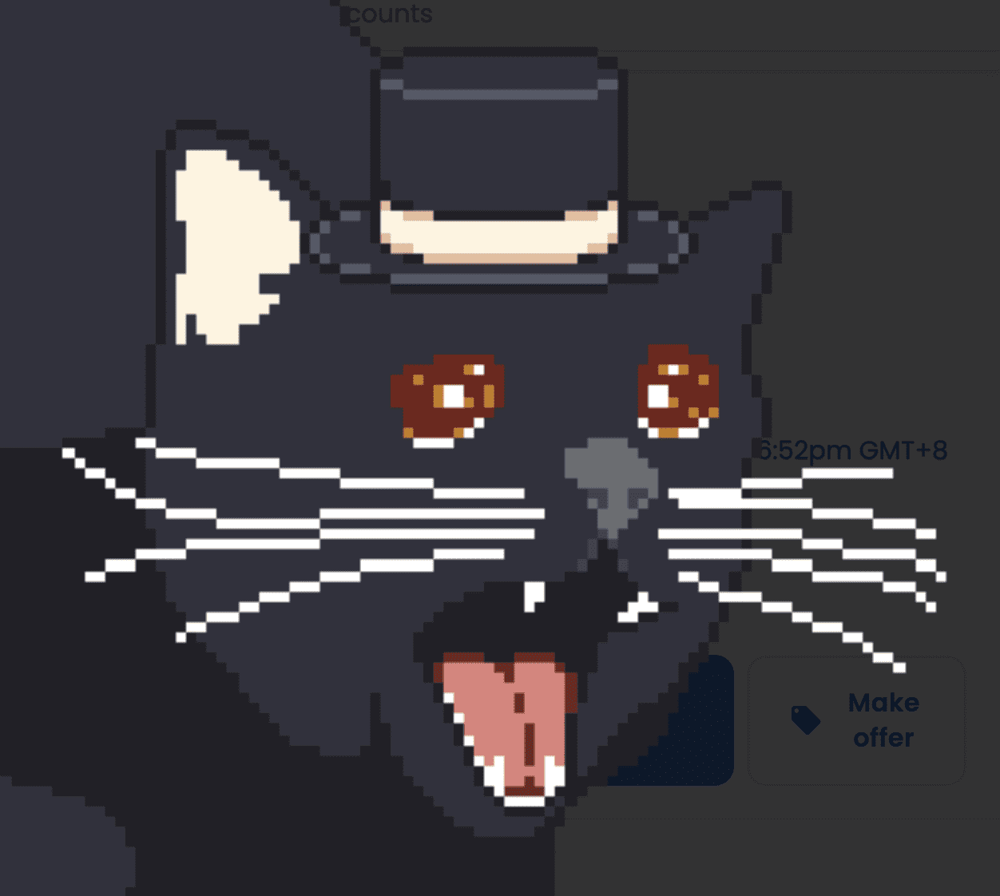

# SadNyang

Sadnyang NFT 是 Claypad 推出的一种新型 NFT，与现有的 NFT 不同，Sadnyang NFT “自动”将二级交易费用分配给持有者，而不是项目所有者。总共有 10,000 种不同的 Sadnyang NFT，NFT 存在且稀有性并不单独存在。

悲伤的猫故事
“我变成了……一只猫吗？”
“硬币？”

我只是一个有工作的普通人。

与此同时，在公司员工的推荐下，我开始投资硬币。

起初，我对赚钱的乐趣感到兴奋。 放入后立即升起的神秘魅力。 我爱上了这个魅力

减去储蓄后，我最终把钱花在了硬币上。

势力是怎么知道的，我一放钱就开始下跌，为了弥补，我

开始投资期货。

