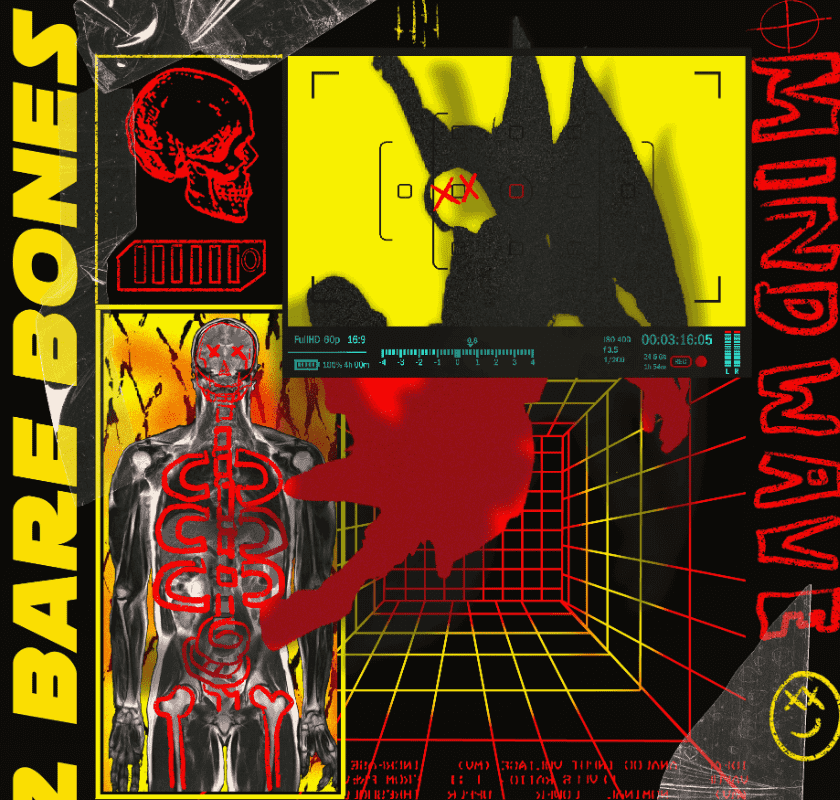

# Saint Archives

圣档案馆是一系列抽象表现主义艺术。 逃避和理想化。 共同的主题包括性、痛苦、救赎、生与死。 SVINT 艺术收据持有人收到用我自己的 Manifold 智能合约铸造的未来新版本的空投       用我自己的歧管智能合约铸造

什么是圣档案？
Saint Archives是NFT（不可替代令牌）的集合。存储在区块链上的数字艺术品的集合。
▶ 有多少圣档案代币存在？
总共有15个圣档案馆NFT.目前有87个所有者在他们的钱包里至少有一个圣档案馆NTF。
▶ 圣档案馆最昂贵的销售是什么？
最昂贵的Saint Archives NFT出售的是SVINT Art Receipt。它在2022-06-09（3个月前）以$ 629.3的价格出售。
▶ 最近卖出了多少圣档案馆？
在过去的30天内，有72个Saint Archives NFT售出。
▶ 圣档案馆的费用是多少？
在过去的30天里，最便宜的Saint Archives NFT销售额低于84美元，最高销售额超过485美元。Saint Archives NFT的中位价格是过去30天内的177美元。
▶ 什么是流行的圣档案馆替代品？
许多拥有Saint Archives NFT的用户还拥有OXO JOURNEY，Virtuoso World，Zanoza Art Bank和GLITTCHH MEE EVERYDAY。

