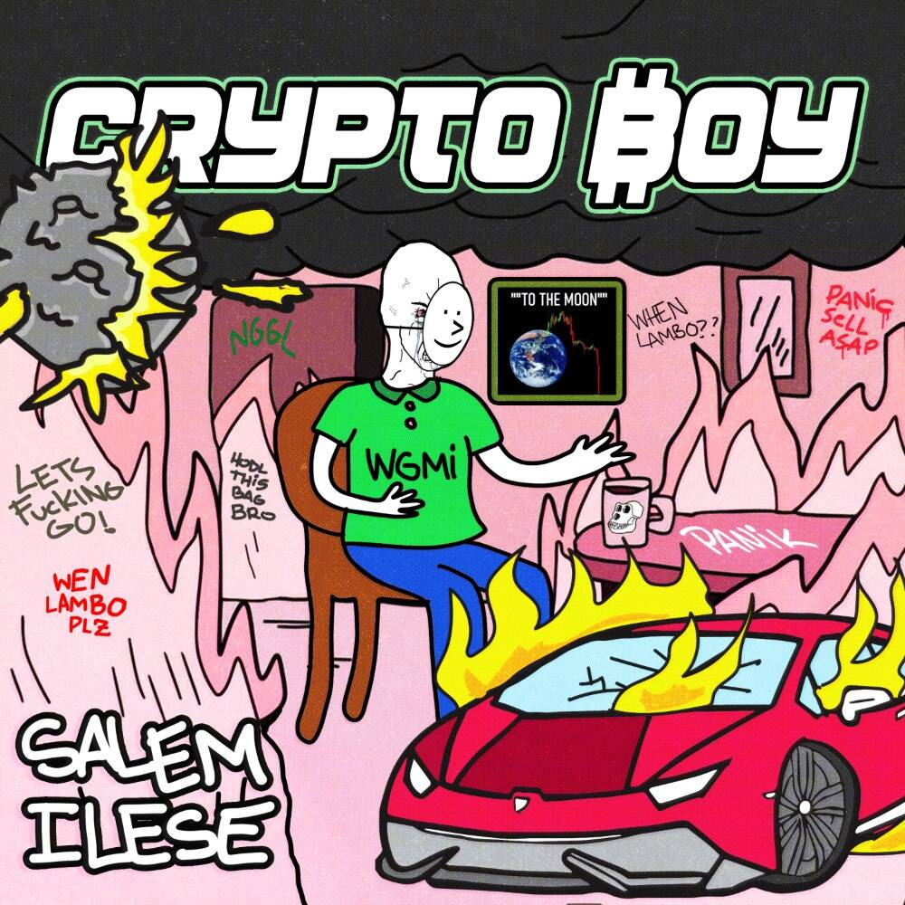

# salem ilese

销售米尔斯
由 Salem ilese 在 Sound 上创建。 对这首歌发表评论

salem ilese 的总销售额为 311.67 美元。 一个 salem ilese NFT 的平均价格为 77.9 美元。 有 658 名 salem ilese 所有者，总共拥有 864 个代币。

什么是塞勒姆酒？
salem ilese 是一个 NFT（非同质代币）集合。 存储在区块链上的数字艺术品集合。
▶ 有多少个 salem ilese 代币？
总共有 864 个 salem ilese NFT。 目前，658 位车主的钱包中至少有一份 Salem ilese NTF。
▶ 最昂贵的 Salem ilese 销售是什么？
出售的最昂贵的 salem ilese NFT 是 Crypto Boy #359。 它于 2022-06-06（3 个月前）以 141.5 美元的价格售出。
▶ 最近卖出了多少个salem ilese？
过去 30 天内售出了 39 个 salem ilese NFT。
▶ Salem ilese 的费用是多少？
过去 30 天，最便宜的 Salem ilese NFT 销售额低于 54 美元，最高销售额超过 136 美元。 在过去 30 天内，一个 Salem ilese NFT 的中位价格为 88 美元。
▶ 什么是流行的塞勒姆替代品？
许多拥有 salem ilese NFT 的用户还在 Sound.xyz 上拥有 Marian Hill、Alexander 23、Siimbiie Lakew 和 Maelstrom。

