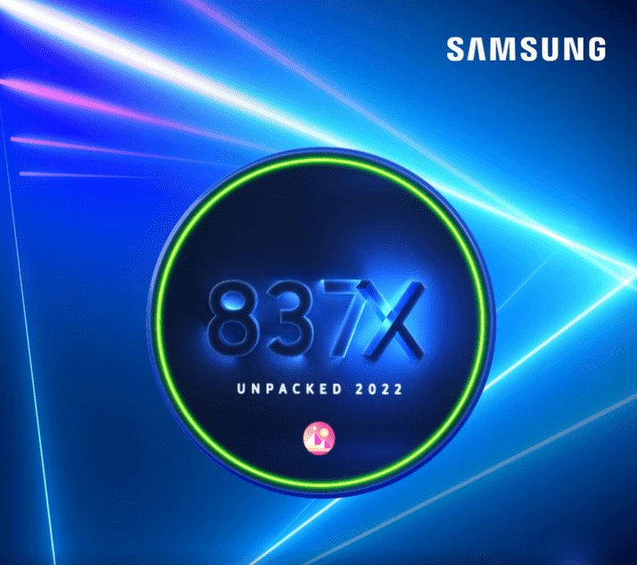

# Samsung 837x Collection Badges

三星 837X 系列是通向 Web3 世界的门户，展示了 NFT 徽章和独特的可穿戴系列供所有人欣赏。 这些定制的 NFT 是艺术、时尚和韩国文化的碰撞。

三星 837x 系列徽章的总销售额为 48.51 美元。 一个三星 837x Collection Badges NFT 的平均价格为 2 美元。 共有 63,462 名三星 837x 收藏徽章拥有者，总共拥有 8 个代币。

什么是三星 837x 系列徽章？
三星 837x 收藏徽章是一个 NFT（非同质代币）收藏。存储在区块链上的数字艺术品集合。
▶ 有多少个 Samsung 837x Collection Badges 代币？
总共有 8 个三星 837x Collection Badges NFT。目前，63,462 位车主的钱包中至少有一个三星 837x 收藏徽章 NTF。
▶ 最昂贵的三星 837x 系列徽章销售是什么？
售出的最昂贵的三星 837x 系列徽章 NFT 是三星 837X You Make It Completion Badge。它于 2022-06-08（3 个月前）以 28.7 美元的价格售出。
▶ 最近售出了多少三星 837x 收藏徽章？
过去 30 天内售出了 367 个三星 837x Collection Badges NFT。
▶ 三星 837x 收藏徽章的价格是多少？
在过去 30 天内，最便宜的三星 837x 收藏徽章 NFT 销售额低于 2 美元，最高销售额超过 3 美元。三星 837x Collection Badges NFT 的中位价格在过去 30 天内为 3 美元。
▶ 有哪些流行的三星 837x 系列徽章替代品？
许多拥有 Samsung 837x Collection Badges NFT 的用户还拥有 Samsung 837X You Make It Collection、Samsung Turning Red Hearts Green、Samsung 837X NFT.NYC Collection 和 Mutant Fkn Apes。

