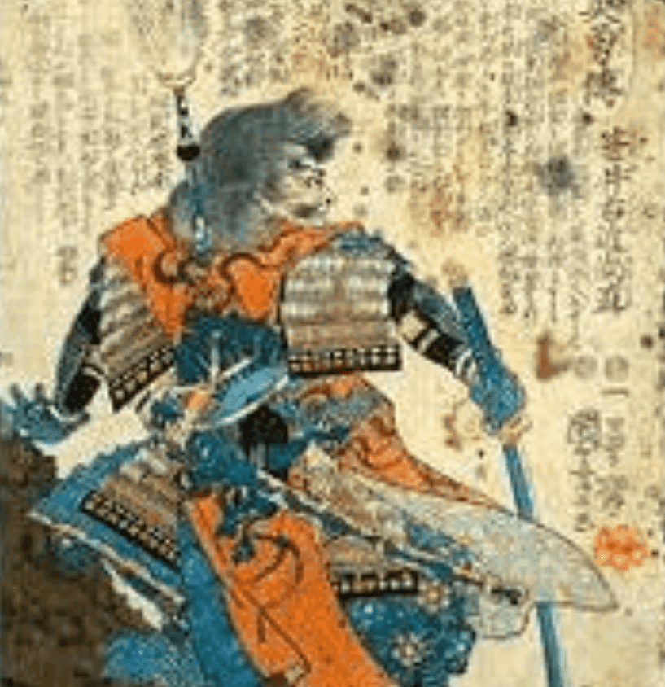

# Samurai | Akane Yin

武士都是用爱和关怀手绘的。 444 件。 没有实用程序，没有路线图，只有艺术。 感谢您的支持

武士的总销量| Akane Yin 是 166.1 美元。 一个武士的平均价格| Akane Yin NFT 为 10.4 美元。 有315武士| Akane Yin 拥有者，拥有 416 个代币的总供应量。

什么是武士 |胤礽？
武士 | Akane Yin 是一个 NFT（非同质代币）集合。存储在区块链上的数字艺术品集合。
▶ 多少武士 |茜殷令牌存在吗？
总共有 416 个武士 | Akane Yin NFT。目前 315 位业主拥有至少一名 Samurai | Akane Yin NTF 在他们的钱包里。
▶ 什么是最昂贵的武士 |茜茜出售？
最昂贵的武士|茜音 NFT 卖掉了。它于 2022 年 6 月 27 日（2 个月前）以 17.6 美元的价格售出。
▶ 多少武士 |茜茜最近被卖了？
有16个武士|过去 30 天内售出的 Akane Yin NFT。
▶ 一个武士多少钱 |茜茵费用？
在过去 30 天内，最便宜的武士 | Akane Yin NFT 销售额低于 9 美元，最高销售额超过 16 美元。武士的中位数价格 | Akane Yin NFT 在过去 30 天内为 10 美元。
▶ 什么是流行的武士 |茜茵的替代品？
许多拥有武士的用户| Akane Yin NFT 还拥有 Punked、RR/APECOIN、KOI POND | Ichigo Tamagashi 和 Gutter Punks 传单 - BAYC。

