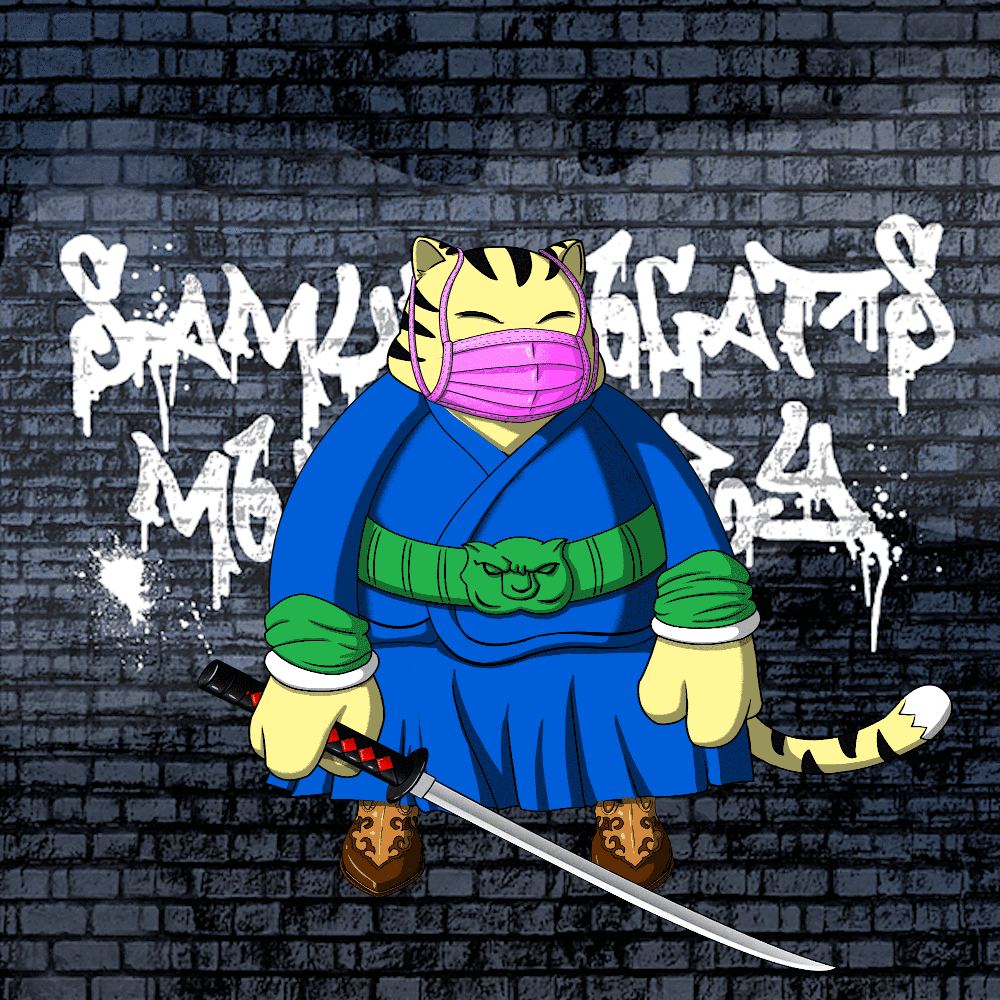

# SamuraiCats by Hiro Ando

Crazy Noodles Gang 由日本艺术家 Hiro Ando 创建，从以太坊区块链上的 4747 只武士猫系列开始。 加入我们的

Hiro Ando 的 SamuraiCats 是什么？
Hiro Ando 的 SamuraiCats 是一个 NFT（不可替代令牌）集合。存储在区块链上的数字艺术品集合。
▶ Hiro Ando 代币有多少 SamuraiCats？
Hiro Ando NFT 总共有 4,747 个 SamuraiCats。目前，1,882 位车主的钱包中至少有一只 Hiro Ando NTF 的 SamuraiCats。
▶ Hiro Ando 最贵的 SamuraiCats 是什么？
Hiro Ando NFT 出售的最昂贵的 SamuraiCats 是 Hiro Ando 的 SamuraiCats。它于 2022 年 6 月 24 日（2 个月前）以 43.9 美元的价格售出。
▶ Hiro Ando 的 SamuraiCats 最近卖出了多少？
在过去的 30 天里，Hiro Ando NFT 共售出了 36 个 SamuraiCats。
▶ Hiro Ando 的 SamuraiCats 多少钱？
在过去的 30 天里，Hiro Ando NFT 最便宜的 SamuraiCats 销售额低于 25 美元，最高销售额超过 36 美元。 Hiro Ando NFT 的 SamuraiCats 在过去 30 天内的中位价格为 33 美元。
▶ Hiro Ando 流行的 SamuraiCats 替代品有哪些？
许多拥有 Hiro Ando NFT 的 SamuraiCats 的用户还拥有 DystoAzuki、Secret Agent Men、Superfuzz The Bad Batch 和 etherstar。

