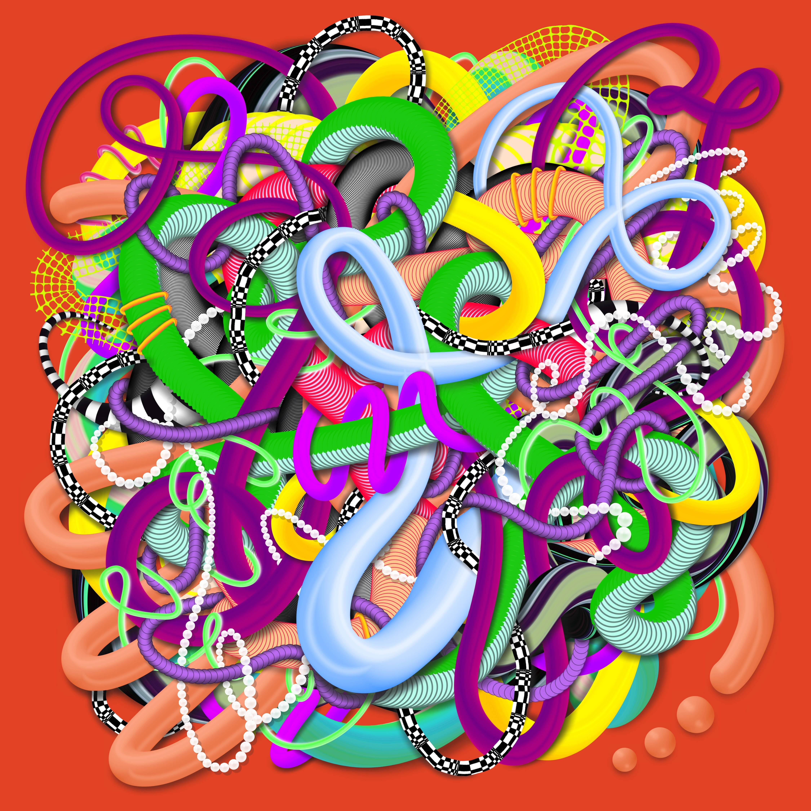

# Sandworms by Jaime Derringer

自 2006 年开始我的艺术实践以来，我一直在画冥想、绳索和蛇状的图画。它们代表了我们每天必须处理的错综复杂的思想和情感网络。 对于焦虑和抑郁的人来说，这些压力和情绪的球尤其难以解开。 画这些——并制作一般的艺术——是我照顾自己心理健康的方式。

Jaime Derringer 的《沙虫》是什么？
Jaime Derringer 的 Sandworms 是一个 NFT（不可替代令牌）集合。 存储在区块链上的数字艺术品集合。
▶ Jaime Derringer 代币存在多少沙虫？
Jaime Derringer NFT 总共有 10 个 Sandworms。 目前 8 位所有者的钱包中至少有一个 Jaime Derringer NTF 的 Sandworms。
▶ Jaime Derringer 的《沙虫》最近卖出了多少？
在过去 30 天内售出 0 件 Jaime Derringer NFT 的 Sandworms。

