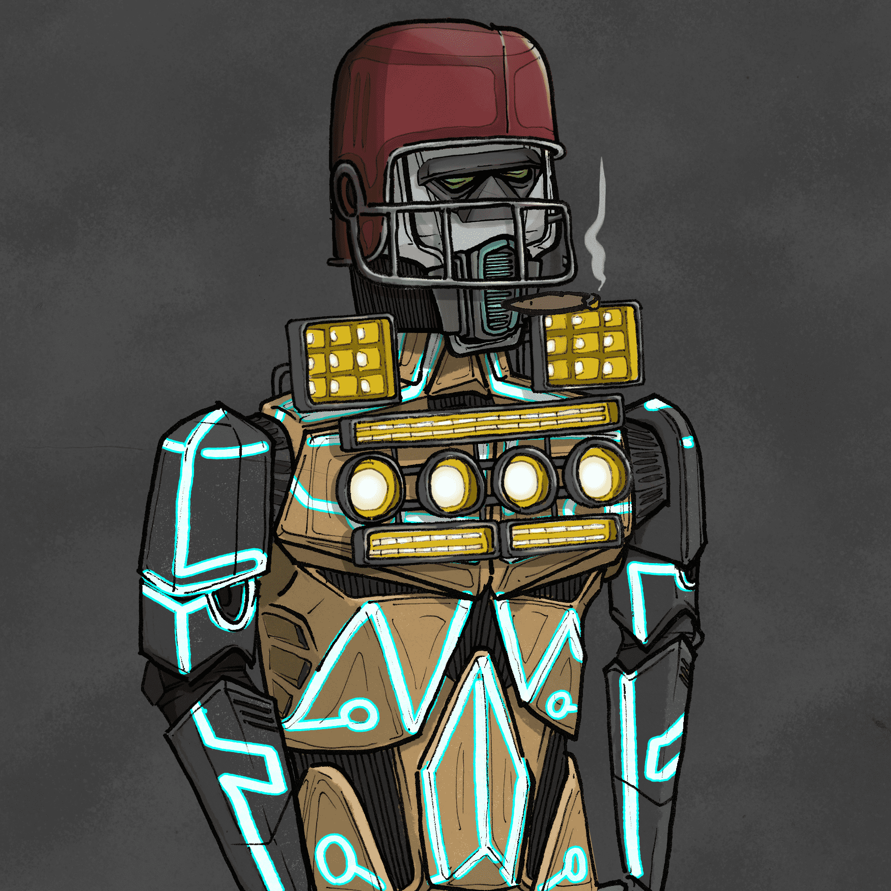

# SANJAY ROBOTS

SANJAY ROBOTS是一个10，000件的生成薄荷NFT系列，来自SANJAY和SICKO项目的艺术家，创作者和社区成员。每个组件都经过精心的手绘、喷漆和扫描，以进行生成装配。

总共将有八种机器人类型。每个都有独特的特征和稀有组合。这些将在未来几天内发布，因为我们越来越接近我们的官方造币厂！

该系列将于美国东部时间9/24/2021下午3：00开始铸造，每NFT为0.069 ETH，使用创新的“公平掉落”结构来减轻淫秽的天然气战争。将有一个透明和包容性的延迟披露，以尊重NFT特征元数据的安全性，该元数据将由中立的第三方监督，以确保所有铸造信息在官方披露之前完全保密。

请注意，每个SANJAY持有人将获得以0.03 ETH的铸币价格私人出售其各自SANJAY #的权利。例如：如果您拥有一台SANJAY，您将有48小时的窗口期通过mint网站上的白名单MINT功能购买一台SANJAY机器人。SANJAY ROBOTS系列的所有前1000个薄荷糖都将如此。接收私人销售的快照将在9月24日星期五正式公开铸造之前进行。如果私人销售未被赎回，则铸币将无人认领，并由团队用于进一步的社区建设工作，例如赠品，竞赛，抽奖或稍后将披露的传说特定事件。

造币厂的更多细节和细节将在未来几天内发布，因为我们宣布并突出显示了我们的项目路线图。它始于2021年4月，与Sanjay Collection一样，充满了创新的社区特定活动，努力以及SANJAY UNIVERSE扩展到2022年，2023年及以后。

