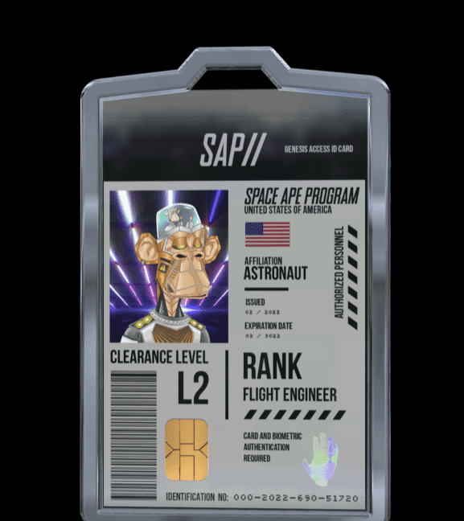

# SAP GENESIS ACCESS

Space Ape 计划 (SAP) GENESIS ACCESS 是您进入 SPACE APE 学院和整个 SAP 世界的注册。 欢迎来到太空计划！SAP是一场跨IP NFT太空竞赛。太空猿计划//访问ID卡//使您向太空更近一步。此访问ID卡可兼作您的太空虚拟门票和进入SPACE APE计划生态系统的门票。

您的访问ID卡NFT如下：

为我们的创世纪滴剂提供薄荷通行证

任务识别Web 3.0空间站接入卡课程清关 （L0-L5）

我们的训练设施由现实世界的NASA和SPACE专业人员编程和指导，包括P2E街机游戏，可兼作您的“身体”训练。

JOIN OUR FIRST-OF-ITS-KIND EXPERIENCE AND LEAVE YOUR DIGITAL FOOTPRINT IN SPACE.
———

ALPHA：鼓励代币持有者参加所有计划活动，包括：开发扩展故事，参加课堂讲座和P2E培训/学习。

创世纪门禁卡的持有者还将有机会从比赛和赠品中赢得各种类型的NFT。SAP生态系统将可以使用其他媒介，例如IRL空间派对，合作产品的折扣等等。

