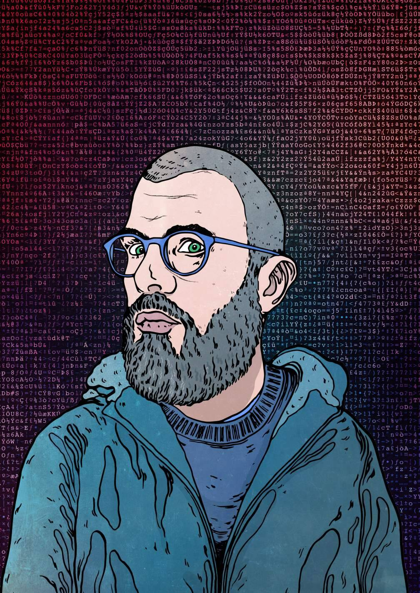

# SatoshiFaces

SatoshiFaces 是 4999 个 NFT 的集合——在以太坊区块链上开发的独特数字收藏品。 Faces 分为两章，从 Genesis 开始，它由生活在 Satoshi 宁静世界中的 3000 个 NFT 组成。 在第 2 章：出埃及记中，情况变得更糟，人物不得不面对后世界末日世界的考验和磨难。 通过在我们全新的 SatoshiFaces Factions 中完成挑战和玩游戏来升级您的 NFT。 所有权包括您的 SatoshiFaces 的全部创意和商业权利，这是 Ed 等屡获殊荣的艺术家所拥有的稀有物。

SatoshiFaces，也称为“Faces”，是由英国著名艺术家 Ed Merlin Murray 创作的 4999 件独特的数字收藏艺术品的集合。所有 SatoshiFaces NFT 都充当“节点”，以每天 5 个的速度生成生态系统独有的 SFT ERC-20 代币 . 该令牌用于访问 SatoshiFaces 平台上的所有当前和未来功能并与之交互。 有关 SatoshiFaces 的更多信息，请访问网站或阅读详细介绍 SFT 的所有内容的中篇文章。

