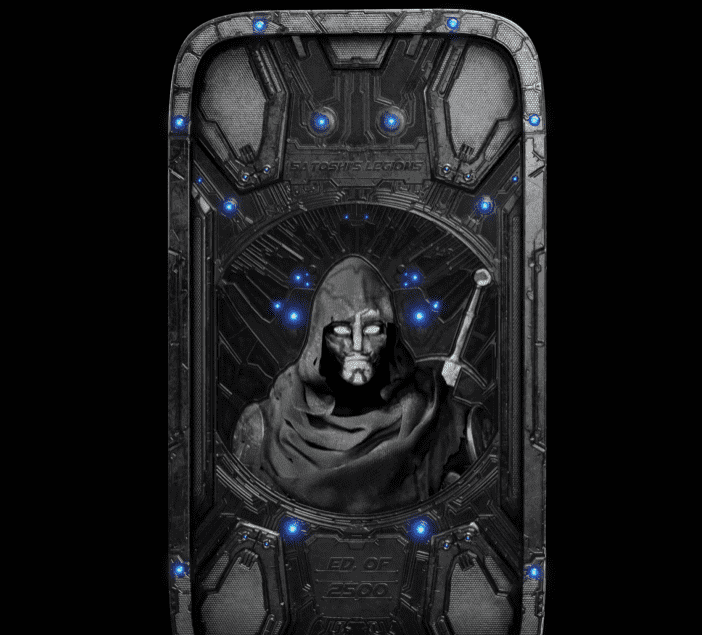

# Satoshis Legions Presale Tokens

重要请阅读 21 年 11 月 22 日美国东部标准时间下午 12:00 拍摄了所有代币持有者的快照。 在该日期之后购买或转让的任何代币都不能用于领取退伍军人证。 

中本聪的军团是中本聪的下一代化身NFT！在中正传说中，在菲亚特的捍卫者控制了世界各地的城市之后，造物主中本聪以半人半机械超级英雄的身份回归，组建了一支军队，夺回了控制权，恢复了人民的基本自由。为此，中本聪联系了来自世界各地的区块链社区的100名领导人“The 100”，并要求他们每个人秘密组建“军团”，领导反对菲亚特捍卫者的叛乱。每个军团都由“军团”组成，他们来自不同的年龄，种族，性别和背景，他们团结一致，以夺回从他们身上夺走的东西。每个军团的标志特征是中本聪给予他们每个人的高科技面具，并允许军团通过打击菲亚特捍卫者为压迫人民而实施的先进监视技术来保持匿名。这些面具还允许军团成员在不被发现的情况下与中本聪和彼此交流，并迅速学习他们在与压迫者的战斗中所需的宝贵战斗技巧。

通过成为军团，你也可以加入战斗！你的军团将不仅仅是你收藏中的另一个化身。这将是你进入中本聪的门票和身份！我们相信，虚拟形象NFT的未来始于令人惊叹的艺术和社区包容，并以实用性结束。我们创建了中本聪的军团来体现这些概念，并将化身NFT提升到一个全新的水平。

