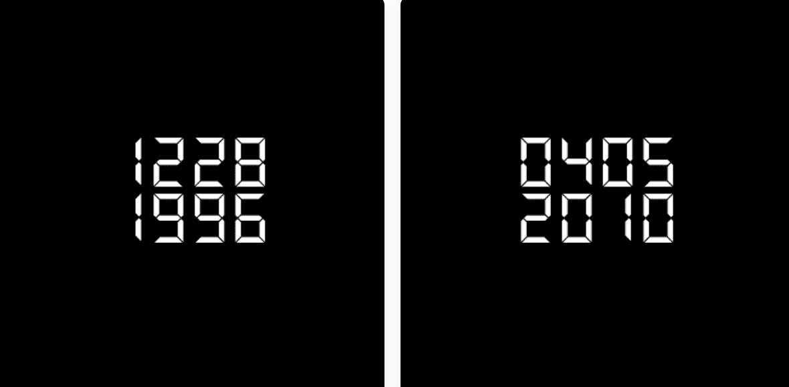

# Save The Date Official

每个 DATE 都是您内心或记忆的一部分，将为您打开一个有价值的世界。一个完美的方式来记住一个特殊的生日、周年纪念日或任何其他重要的日期，随着时间的推移继续释放价值。

一系列 18,250 个 NFT，其中每个 DATE 是 8 个数字的 1/1 唯一组合，这些数字共同代表过去 50 年中的一天。

我们不相信制造虚假的稀缺性。这个数字对我们来说是象征性的，对每个人来说都是包容的。每个人都至少有自己珍视的一天。它可能是一个生日，一个周年纪念，一个时刻，一个回忆。
SAVE THE DATE 是一个 NFT 项目，可让您保留 DATE 并继续永远庆祝它。

