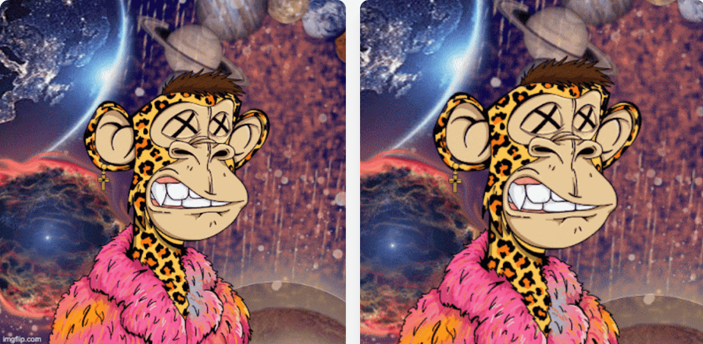

# Space Bored Ape Club Official

关于
Space Bored Ape Club 是 5,555 只进化、独特和集成的宇航员猿的集合，它们在以太坊生态系统草地的太空中漫游，等待你铸造你的免费 NFT 并将其带到月球。我们希望建立一个超越互联网进入现实世界的良性社区。我们的愿景
Space Bored Ape 俱乐部是在他们新成立的公司 Az Labz 旗下的 Bored Ape 游艇俱乐部持有人和社区成员 Aizaz & Aneeq 的头脑中产生的。 Space Bored Ape Club 希望通过促进 Web3 社区之间的竞争和协作的协同机制来扩展其社区。该系列将从铸造 5,555 只无聊猿开始，每只都为其持有者提供特殊特权和访问权限。无聊的猿将有各种各样的特征、类型和不同的美学。持有无聊猿将为您保留一个宝座，作为以太坊生态系统中存在的无聊猿社区的精英成员。

此外，Space Bored Ape Club 将提供独家繁殖合同，通过将猩猩与自己的超银河血清融合来变异猩猩，从而创造出自己的异化猩猩品种。最多可以创建 16,665 个这些外星人。与 BAYC 和 MAYC 的上限不同，Bored Ape 中的每一个都可以使用所有三种血清单独疏远，因此最多可生成 5,555 x 3: 16,665 NFT。尽管异形猿需要异化无聊猿，但它们不会继承它们的特征。相反，外星人会有自己的特征，甚至会被与那里不同的颜色和特征疏远，被无聊的猿类疏远。随着 AZ Labz 随着时间的推移继续研究外星猿，将会有更多关于外星猿的信息。

我们将通过附加功能和更新来扩展 Space Bored Ape Club 世界，使其以社区最重视的方式不断发展。

