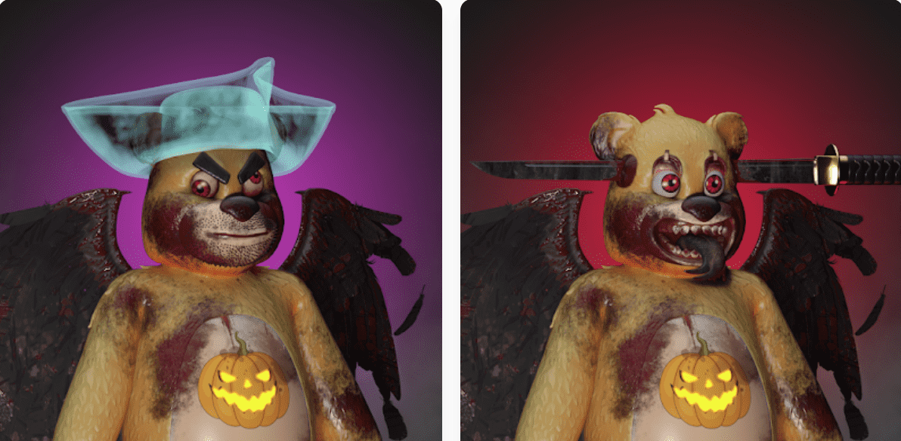

# ScareBears Official

ScareBears Christmas 是 Polygon 区块链上 4444 个独特随机生成的圣诞熊的集合。 ScareBears 圣诞系列包含三个突出的主题：恐怖、熊和圣诞节。 ScareBears 持有者可以领取圣诞熊。每只 ScareBear 都可以无限期地免费领取一只圣诞熊（加汽油）。ScareBears 官方 NFT - 问题常见 (FAQ)
▶ 什么是 ScareBears 官方？
ScareBears Official 是 NFT（不可替代令牌）集合。存储在区块链上的数字收藏品集合。
▶ ScareBears 官方代币有多少？
有3个ScareBear官方NFT现在25个ScareBear中，有一个ScareBears。
▶ 精确到什么程度？
过去30个官方共售出0个ScareBears。

