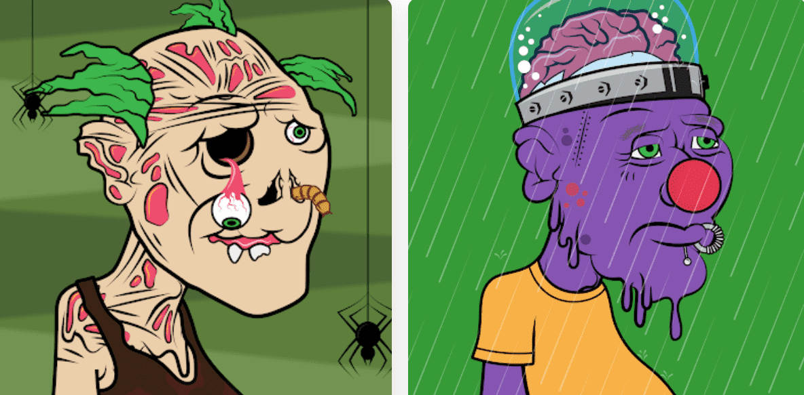

# Scary Neighbors Club

可怕的邻居是由基于 175 个不同特征的算法自动生成的 3,333 个 NFT 的集合！每个邻居都是独一无二的，他们生活在以太坊多边形区块链中。所有邻居都托管在 IPFS 上。邻居俱乐部 NFT - 常见问题（FAQ）
▶ 什么是恐怖联盟俱乐部？
NFT（不可替代上）集合。存储在区块链的数字收藏品集合。
▶ 有多少人的俱乐部代币？
28个恐怖分子车中有一个NTF俱乐部3,33个俱乐部。目前，28个俱乐部的主人的钱包中至少有一个NTF。
▶ 最恐怖的邻居俱乐部促销活动是什么？
制作的最恐怖的恐怖邻居俱乐部 NFT 是恐怖邻居 #905。它于 2022-06-07（3 个月前）以 4.5
▶最近卖了多少地方的俱乐部？
过去 30 个人的售卖 4 个社区俱乐部 NFT。

