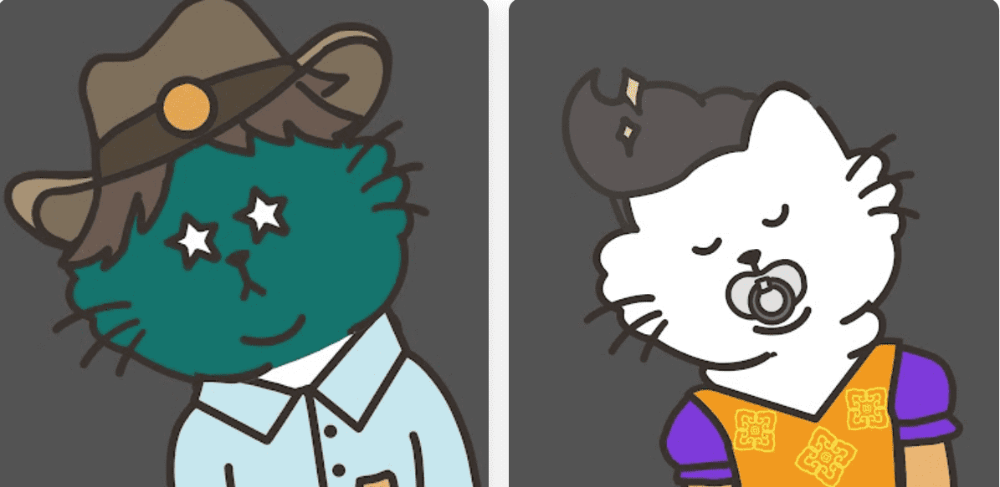

# SCHRTDINGERs CAT NFT

薛定谔的猫由世界各地的猫爱好者组成，是第一个基于美国防止虐待动物协会 (ASPCA) 发布的 NFT 集合。薛定谔的猫呼吁世界各地的人们加入保护流浪动物的组织。

ASPCA 是一个私人资助的 501(c)(3) 非营利组织，所有收入都用于救助流浪动物。

ASPCA是世界上最大的动物保护协会之一，在全球拥有超过200万支持者。对于薛定谔猫 NFT 的每一分钱，都会拯救和照顾一只真正的流浪动物。所有收入将捐赠给ASPCA（北美最大的流浪动物保护组织，全球粉丝200W）和NFT市值维护。 , 10,000 只独一无二的薛定谔猫 NFT 旨在促进对流浪动物的保护，表达你的爱很酷，不是吗？

