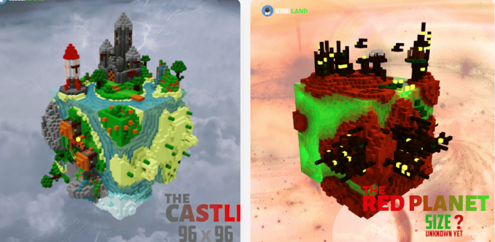

# SCooBi LANDS

倒塌的结构迷失在特兰西瓦尼亚森林的中间，来自第一部漫画 NFT 剧集“Bite Coin Quest”，Cezee 公主带着她的猫被骨头团伙追赶离开。社区驱动的故事，MEMES 治理代币，NFT 与实物资产挂钩，跨链代币，我的世界服务器，跨平台游戏，SCooBi LANDS NFT - 问题常见（FAQ）
▶ 什么是 SCooBi LANDS？
SCooBi LANDS 是一个 NFT（非同质代币）集合。存储在区块链上的数字收藏品集合。
▶ 存在多少个SCOoBi LANDS 代币？
iBooo有640个SCooo的局域网中，96个N个DS的钱包中至少有一个SC。
▶最近有多少个SCooB？
过去 30 个 SCooB 出i 0 个 SCooB LANDS NFT。

