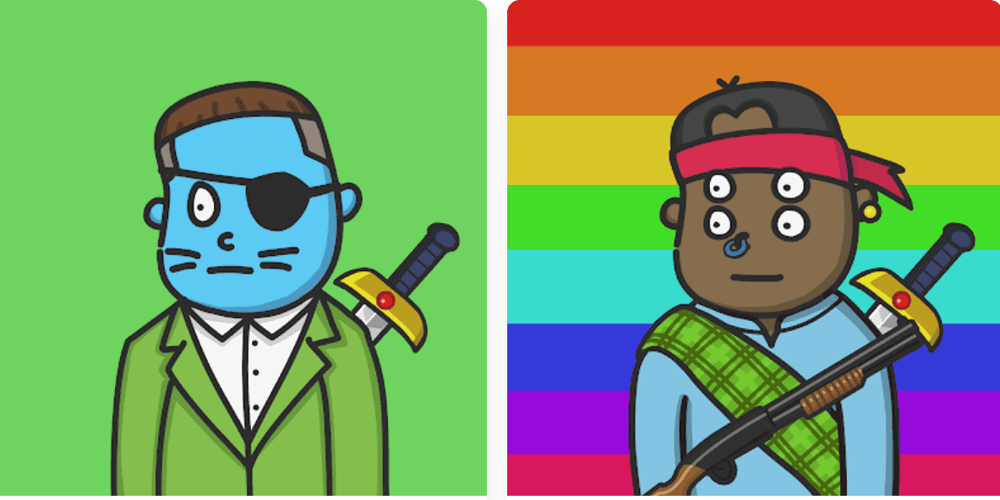

# Scotch Noblemen

准备好与 10,001 名苏格兰贵族一起对 Nessie 进行最大规模的探索，见证他们恢复对自己文化和祖先的信仰！苏格兰贵族 NFT - 常见问题 (FAQ)
▶ 什么是苏格兰贵族？
Scotch Noblemen 是一个 NFT（非同质代币）集合。存储在区块链上的数字收藏品集合。
▶ 有多少苏格兰贵族代币？
个苏格兰贵族的NFT，目前160位车中至少有一个苏格兰贵族NFT。
▶ 最贵的苏格兰贵族拍卖会是什么？
出售的最贵的 Scotch Noblemen NFT 是 Scotch Noblemen #300。它于 2022-06-30（2 个月前）以 38.4 美元的价格售出。
▶最近多少苏格兰贵族？
过去30个blemen N共售出11个Scotch No。
▶ 苏格兰贵族要什么？
在过去的 30 天里，苏格兰 NFT 的价格为 10 美元。

