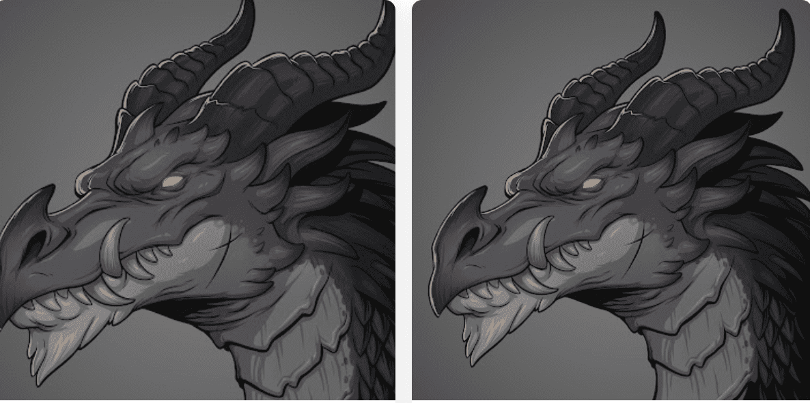

# Scoundrels Dragons

恶棍龙是恶棍薄荷创世的前奏。这些凶猛的生物带来了如山般的好处。每个人都会提供与 Scoundrels 相关的独特奖品，包括 sGold、WL 甚至免费薄荷糖。它们还将用于 Dragon Arena PVP 游戏中心，持有者将有机会与其他持有者争夺 sGold 和战利品。▶ 什么是恶棍龙？
Scoundrels Dragons 是一个 NFT（非同质代币）集合。存储在区块链上的数字收藏品集合。
▶ 有多少个恶棍代币？
4个有11,00个Scoundrels NFT。目前18个Scoundrels中至少有一个Scoundrels。
▶ Scoundrels Dragons 最昂贵的促销活动是什么？
卖得最贵的 Scoundrels Dragons NFT 是稀有金龙。它于 2022-06-07（3 个月前）以 63.5 美元的价格售出。
▶最近卖了多少恶棍龙？
过去30s共售出1个 Scoundrels Dragons。

