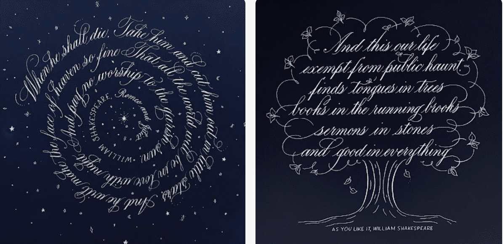

# Scripted Quotes

8 年前，我开始了我的书法创作之旅。我不仅通过这种艺术找到了自己的声音，而且我很幸运地为 Goop、Martha Stewart 和 Tiffany & Co 做书法作品。我什至有机会写一本关于铜版书法的指导书。由莎拉·理查森 (SarahScript) 书写的一系列名言。莎拉练习书法超过 7 年。她毕业于亨德里克斯学院，获得艺术史和西班牙语跨学科文学学士学位。 2018 年，她毕业于加州大学洛杉矶分校，获得设计传播艺术证书。她曾为 Goop、Tiffany and Co. 等公司做过现场书法。她是《从 A 到 Z 的铜版书法：掌握优雅尖笔刻字的分步练习册》的作者。

