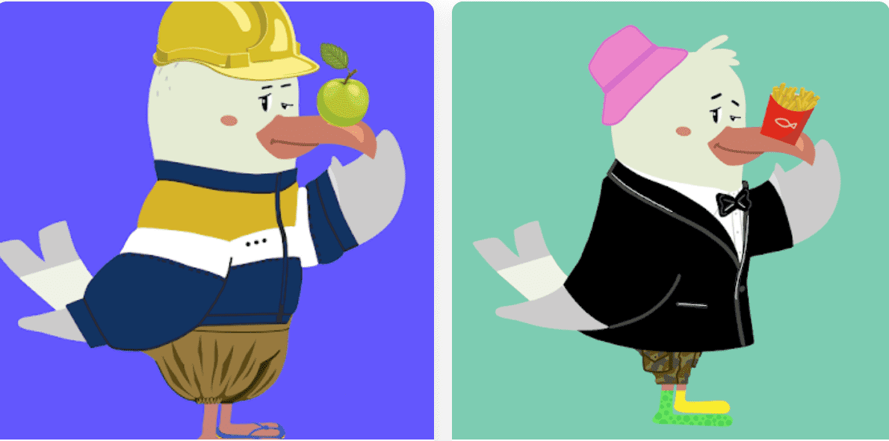

# The Seagull Finds His Talent

AlphaBetty NFT 中的 1,000 多个 ETH 已在二级市场上交易，Betties 由 3,000 多名独特的所有者持有，其中包括名人、专业运动员、知名社交媒体影响者以及大量 Apes、Cats、VeeFriends、Women 和其他野生动物。
我们已经做了一些好事，并且已经将 NFT 空间改得更好。话虽如此，我们想让您更深入地了解我们长期存储的内容。2019 年自行出版的 Cheryl 的第一本儿童读物《海鸥发现他的才华》的合集。每个人都有才华，有时不止一个。当海鸥发现他的生活变得更加有趣......

