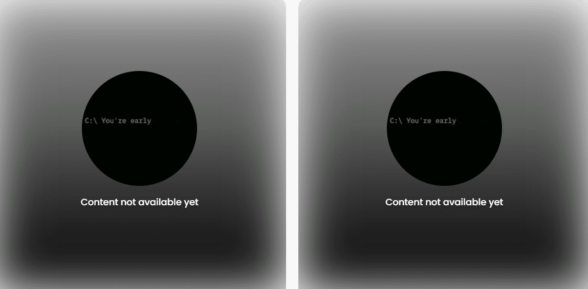

# You Are Getting Closer...

你越来越近了...... NFT - 常见问题（FAQ）
▶ 什么是你越来越近...？
You Are Getting Closer... 是一个 NFT（非同质代币）集合。存储在区块链上的数字收藏品集合。
▶ 有多少 You Are Getting Closer... 代币存在？
你有一个 NFT 正在接近 5,00 个。目前，1,345 个距离你正在接近。
▶最近接近了多少个…？
过去 30 个您正在接近售卖 0 个您... NFT。
▶ 什么是流行的 You Are Getting Closer... 替代品？
拥有 You Are Getting Closer... NFT 的用户如果您正在阅读，请检查我们的操作系统，但盒子里有什么？、AIRobots ETH 和 Invisibears。

