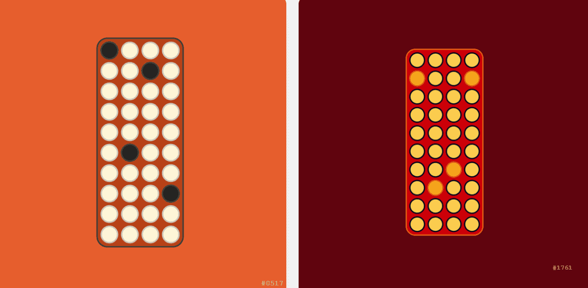

# Seed Phrase.

欢迎来到“种子短语”

Seed Phrase 是一个完全链上的“加密原生”集合（是的，甚至是艺术一代😎）。这个项目的每一个决定都是在考虑到可用的区块链技术的情况下做出的。

我对这个项目的意图很简单——向我之前的人致敬，并激励那些将在这里的人。NFT - 常见问题（FAQ）
▶ 什么是助记词。？
莫名其妙。是NFT（替代币）集合。存储在区块链上的一个不可收藏品收藏。
▶ 多少种子。代币存在吗？
现在有557个电影里有一个。
▶ 什么是最昂贵的病种。
出售的 NFT 是 Seed Phrase #769。它于 2022-07-01（大约 2 个月前）以 19.7 美元的价格售出。

