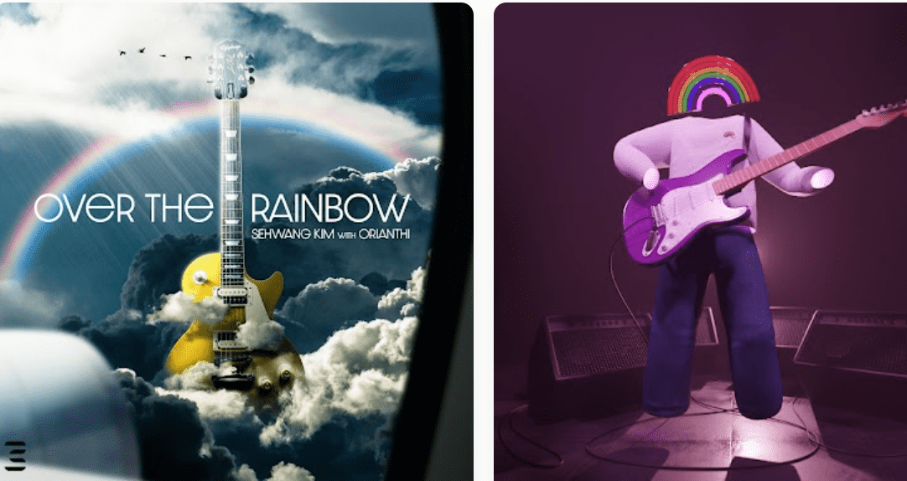

# Kim SeHwang

传奇吉他手 Kim SeHwang 的 NFT 系列ONEUM项目的第一张合辑ONEUM Compilation Vol.1已经发行！
这张 NFT 专辑包含三位艺术家 Beat.K、daf. 和 Delta O Yanni 使用全音 NFT 提供的韩国传统乐器的声音样本创作的歌曲。您可以通过国内著名的 NFT 艺术家 Calliart Ato、1stride 和 Manju 的作品，享受以不同色彩诠释的韩国传统音乐的欢乐和精神。 ONEUM Compilation NFT 受“3PM 音乐许可”的约束，即使用 3PM 提供的创意作品的权利。相应地，所有购买了ONEUM Compilation NFT的持有者都可以自由使用本NFT中包含的媒体内容进行自己的NFT创作活动。

