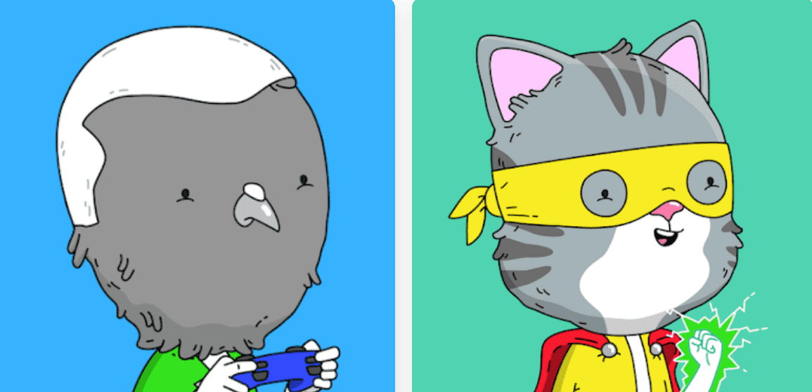

# SemiSupers by SeeMikeDraw

这是银河系最大的（ish）半超级英雄联盟！准备好被 MILDY AMAZING 英雄、中度邪恶的恶棍，当然还有一两个僵尸变种之间的 ULTIMATE(ish) 摊牌所打动查看MikeDraw NFT的SemiSupers - 常见问题（FAQ）
▶ SeeMikeDraw 的 SemiSupers 是什么？
参见 MikeD 的 SemiSupers 是 NFT（代币）一个集合。不可在链上的数字收藏品存储集合。
▶ SeeMikeDraw 代币有多少个SemiSupers？
SeeMikeDraw NFT 5 个主播，目前有半个 Super1,55 个 SemiSuper1,303 车的中至少有一个 SeeMDraw NTF。
▶ SeeMikeDraw 销售的最昂贵的 SemiSupers 是什么？
查看 MikeDraw NFT 出售的最昂贵的 SemiSupers 是 Hero #3301。它于 2022-06-30（2 个月前）以 43.9 美元的价格售出。
▶ SeeMikeDraw 的 SemiSupers 最近发售多少？
在过去的 30 台 N 4 FT 中售出 1 台 SemiSupers。
▶ SeeMikeDraw 的 SemiSupers ？
在过去的 30 天中 NFT 的超级半中，请参见 3 美元 35 美元的 13 美元，最多超过 3 美元。

