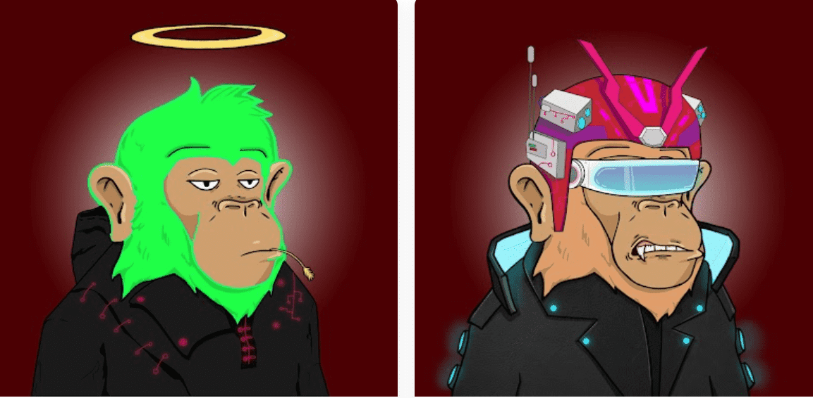

# Seoul Apes Official

首尔猿是 5555 只独特的赛博朋克猿的集合，其灵感来自韩国首尔令人眼花缭乱的城市夜景。通过拥有首尔猿，会员可以投票决定他们希望首尔体验的外观 - 由首尔猿社区财政部资助。首尔见！首尔猿官方NFT - 常见问题（FAQ）
▶ 什么是首尔猿官方？
Seoul Apes Official 是一个 NFT（非同质代币）集合。存储在区块链上的数字收藏品集合。
▶ 首尔猿官方代币有多少？
个子有5个首尔头像官方1,796个头像官方。目前，74位首尔头像中至少有一个头像NTF。
▶ 首尔猿官方最接近了多少？
过去30首尔共售出0个NFT。

