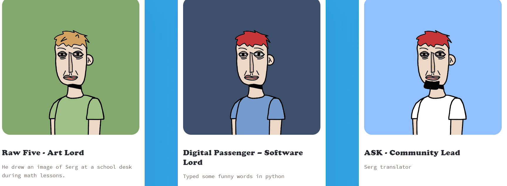

# Sergs

3D Sergs 是来自 OG CryptoSergs 集合的独特且随机生成的化身，用于加密弯曲、游戏和元界探索。

SERG GANG 将联合起来🤝Sergs NFT - 常见问题（FAQ）
▶ 什么是军士？
Sergs 是一个替代品（不可替代）收藏在区块链上的数字收藏品集合。
▶ 存在多少个 Sergs 代币？
有636个Sergs NFT，目前有311个位的sergs。
▶最近多少个塞尔格
过去 30 条用户提供了 1 个 Serg NFT。第一批 Serg 被铸造出来，开启了 NFT 市场的新纪元。整个春天，一些 sergs 被出售并获得了 NFT 社区的认可。该系列开始适应新的市场趋势并远离结合曲线。

