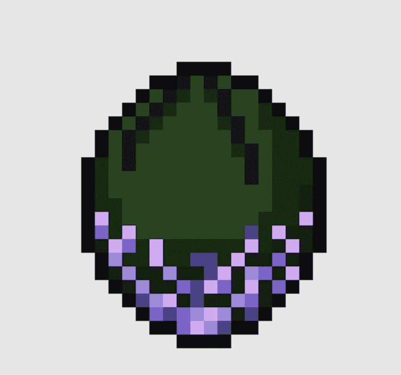

# Space Game - Darkness Egg

太空游戏 - 黑暗蛋 NFT - 常见问题（FAQ）
▶ 什么是太空游戏——黑暗之蛋？
Space Game - Darkness Egg 是一个 NFT（非同质代币）系列。 存储在区块链上的数字艺术品集合。
▶ Space Game - Darkness Egg 代币有多少？
总共有 55 个 Space Game - Darkness Egg NFT。 目前 31 位所有者的钱包中至少有一款 Space Game - Darkness Egg NTF。
▶ 什么是最昂贵的太空游戏 - 黑暗之蛋特卖？
最昂贵的太空游戏 - Darkness Egg NFT 是 Darkness Egg #7。 它于 2022 年 6 月 23 日（2 个月前）以 494 美元的价格售出。
▶ Space Game - Darkness Egg 最近卖出了多少？
过去 30 天内共售出 4 个 Space Game - Darkness Egg NFT。
▶ 什么是流行的太空游戏 - 黑暗之蛋替代品？
许多拥有 Space Game - Darkness Egg NFT 的用户还拥有 Space Game - Fire Egg、Space Game - Poison Egg、Space Game - Spidox Droid 和 Space Game - Water Egg。

