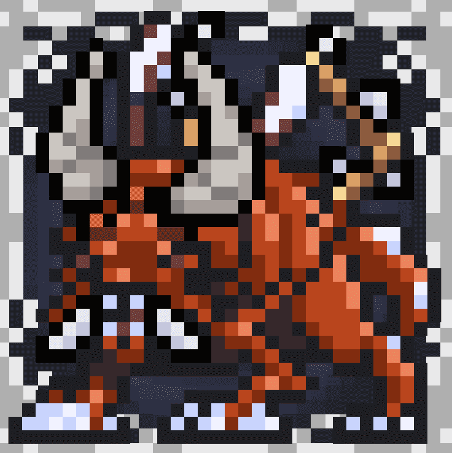

# Space Game - Marines & Aliens V2

Space Game - Marines & Aliens V2 NFT - 常见问题（FAQ）
▶ 什么是太空游戏 - Marines & Aliens V2？
Space Game - Marines & Aliens V2 是一个 NFT（非同质代币）合集。存储在区块链上的数字艺术品集合。
▶ 有多少 Space Game - Marines & Aliens V2 代币？
总共有 23,474 个 Space Game - Marines & Aliens V2 NFT。目前，447 位所有者的钱包中至少有一款 Space Game - Marines & Aliens V2 NTF。
▶ 什么是最昂贵的 Space Game - Marines & Aliens V2 销售？
最昂贵的 Space Game - Marines & Aliens V2 NFT 是 Alien #24743。它于 2022 年 6 月 22 日（2 个月前）以 274.3 美元的价格售出。
▶ Space Game - Marines & Aliens V2 最近卖出了多少？
过去 30 天内共售出 515 个 Space Game - Marines & Aliens V2 NFT。
▶ Space Game - Marines & Aliens V2 需要多少钱？
过去 30 天，最便宜的 Space Game - Marines & Aliens V2 NFT 销售额低于 7 美元，最高销售额超过 33 美元。过去 30 天 Space Game - Marines & Aliens V2 NFT 的中位价格为 10 美元。
▶ 什么是流行的 Space Game - Marines & Aliens V2 替代品？
许多拥有 Space Game - Marines & Aliens V2 NFT 的用户还拥有 Space Game - Marines & Aliens、Space Game - Founder Pass、Space Game - Water Egg 和 Space Game - Fire Egg。

