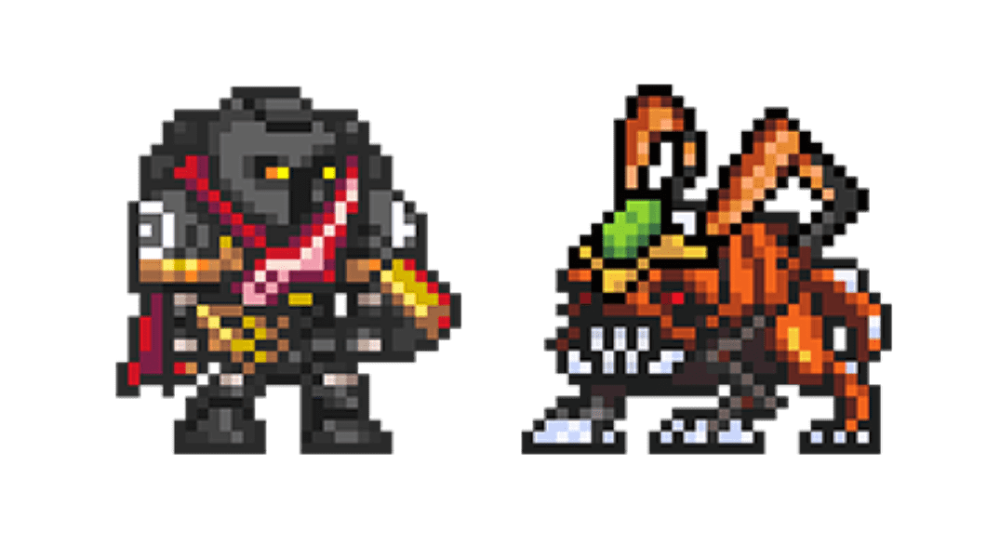

# Space Game - Poison Egg

太空游戏 - 毒蛋 NFT - 常见问题（FAQ）
▶ 什么是太空游戏 - 毒蛋？
Space Game - Poison Egg 是一个 NFT（非同质代币）集合。存储在区块链上的数字艺术品集合。
▶ Space Game - Poison Egg 代币有多少？
总共有 300 个 Space Game - Poison Egg NFT。目前 182 位拥有者的钱包中至少有一款 Space Game - Poison Egg NTF。
▶ 什么是最昂贵的太空游戏 - 毒蛋特卖？
最贵的太空游戏——毒蛋 NFT 是 .它于 2022 年 6 月 25 日（2 个月前）以 136.6 美元的价格售出。
▶ 太空游戏-毒蛋最近卖了多少？
过去 30 天内共售出 12 个 Space Game - Poison Egg NFT。
▶ 太空游戏-毒蛋要多少钱？
过去 30 天，最便宜的太空游戏——毒蛋 NFT 销售额低于 72 美元，最高销售额超过 139 美元。 Space Game - Poison Egg NFT 在过去 30 天内的中位价格为 93 美元。
▶ 什么是流行的太空游戏 - 毒蛋替代品？
许多拥有 Space Game - Poison Egg NFTs 的用户还拥有 Space Game - Fire Egg、Space Game - Water Egg、Space Game - Spidox Droid 和 Space Game - Darkness Egg。

