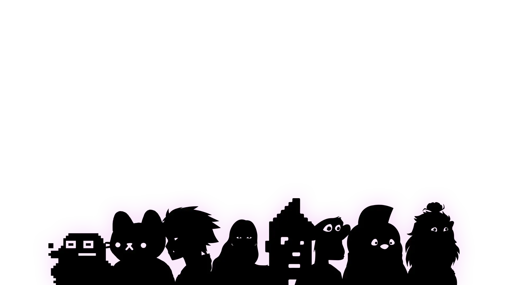

# Shadowfied BAYC

Shadowfied BAYC NFT - 常见问题（FAQ）
▶ 什么是 Shadowfied BAYC？
Shadowfied BAYC 是一个 NFT（不可替代令牌）集合。 存储在区块链上的数字艺术品集合。
▶ Shadowfied BAYC 代币有多少？
总共有 10,000 个 Shadowfied BAYC NFT。 目前，2,279 名所有者的钱包中至少有一个 Shadowfied BAYC NTF。
▶ Shadowfied BAYC 最昂贵的交易是什么？
售出的最昂贵的 Shadowfied BAYC NFT 是 Shadowfied BAYC #4589。 它于 2022-08-22（8 天前）以 4.2 美元的价格出售。
▶ 最近卖出了多少Shadowfied BAYC？
过去 30 天内售出了 1 个 Shadowfied BAYC NFT。
▶ 什么是流行的 Shadowfied BAYC 替代品？
许多拥有 Shadowfied BAYC NFT 的用户还拥有 Infamous Souls、Rarible Fresh Drip Merch、Cupid Love Rose 和 Bored Bulls Yacht Club。

