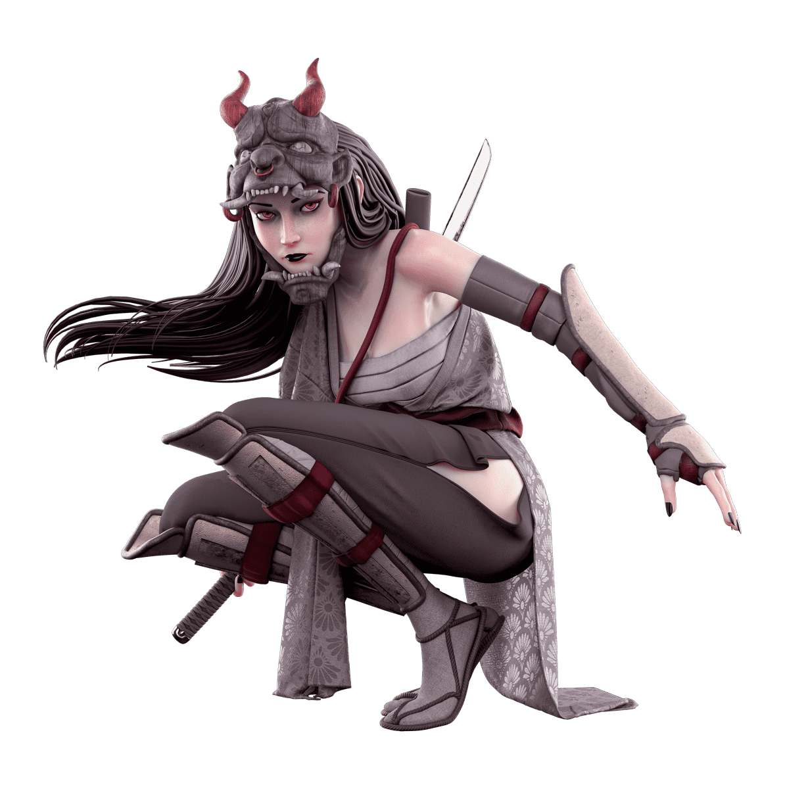

# Shamanzs OfficiaI

Shamanzs 官方 NFT - 常见问题（FAQ）
▶ 什么是萨满教官员？
Shamanzs Official 是一个 NFT（非同质代币）集合。 存储在区块链上的数字艺术品集合。
▶ 存在多少萨满官方代币？
总共有 2,036 个 Shamanzs 官方 NFT。 目前，112 位所有者的钱包中至少有一个 Shamanzs Official NTF。
▶ 什么是最昂贵的 Shamanzs 官方销售？
售出的最昂贵的 Shamanzs Official NFT 是 #74。 它于 2022-07-03（大约 2 个月前）以 87.8 美元的价格售出。
▶ 最近卖出了多少萨满官方？
过去 30 天内售出了 2 个 Shamanzs 官方 NFT。
▶ 什么是流行的 Shamanzs Official 替代品？
许多拥有 Shamanzs Official NFT 的用户还拥有 Shamanzs Genesis、Lofi Originals、Mindbloon V2 和 Kahiru。

