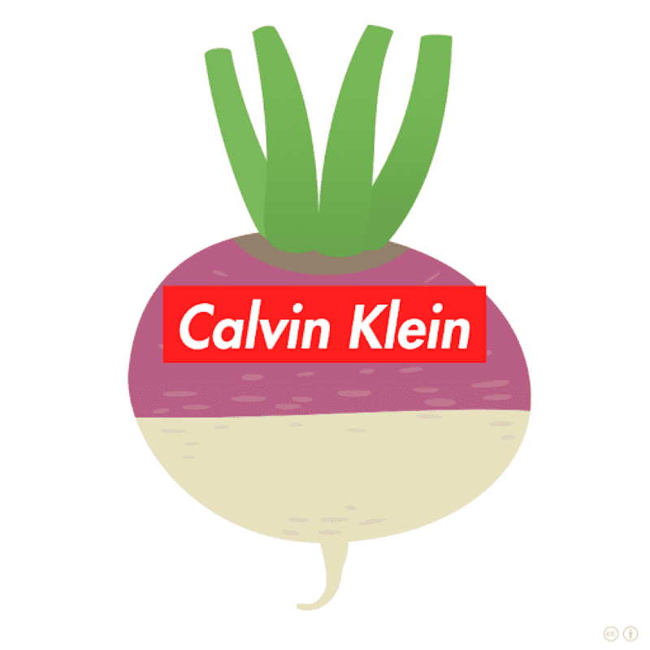

# ShanghaiQing

ShanghaiQing NFT - 常见问题（FAQ）
▶ 什么是沪青？
ShanghaiQing 是一个 NFT (Non-fungible token) 集合。 存储在区块链上的数字艺术品集合。
▶ 上海清代币有多少？
上海清 NFT 总共有 1000 个。 目前有 578 位车主钱包里至少有一个上海清 NTF。
▶ 上海清拍最贵的是什么？
上海青售出的最贵 NFT 是上海青#448。 它于 2022 年 6 月 11 日（3 个月前）以 18.4 美元的价格售出。
▶ 上海清最近卖了多少？
过去 30 天内卖出了 15 个上海清 NFT。
▶ 上海清车多少钱？
过去 30 天，上海清 NFT 最便宜的销售额低于 12 美元，最高销售额超过 18 美元。 过去 30 天上海清 NFT 的中位数价格为 13 美元。
▶ 上海青流行的替代品有哪些？
许多拥有上海清 NFT 的用户还拥有 IZUKI ZEN、SeeDAO Genesis、NMSL NFT 和 Cloud Clouts。

