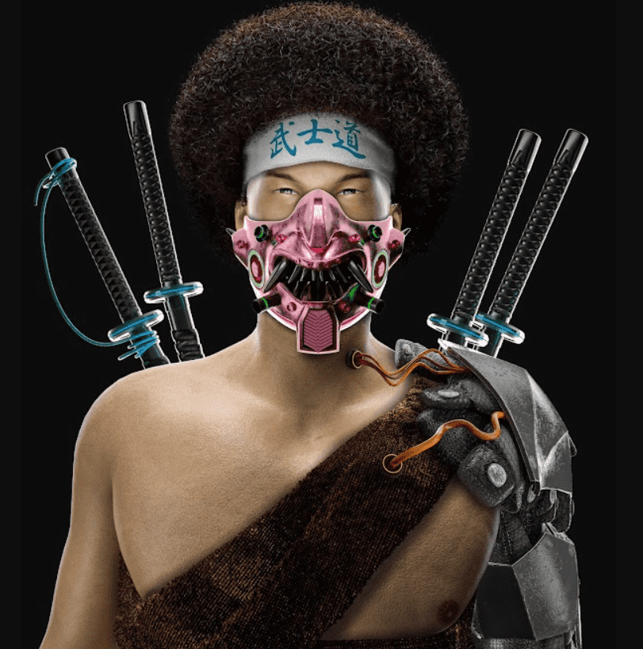

# Shaolin Samurai Warriors

少林武士 NFT - 常见问题（FAQ）
▶ 什么是少林武士？
少林武士是一个 NFT（非同质代币）系列。 存储在区块链上的数字艺术品集合。
▶ 少林武士代币有多少？
总共有 500 个少林武士 NFT。 目前 248 位车主的钱包中至少有一本少林武士 NTF。
▶ 最贵的少林武士特卖是什么？
售出的最昂贵的少林武士 NFT 是 SSW #230。 它于 2022 年 6 月 7 日（3 个月前）以 125.1 美元的价格售出。
▶ 最近卖出了多少少林武士？
过去 30 天内共售出 4 个少林武士 NFT。
▶ 什么是流行的少林武士替代品？
许多拥有少林武士 NFT 的用户还拥有 BallerHeadz、EL NUMEROS、DegenOkayBears 和 WaterBe4nZuki。

