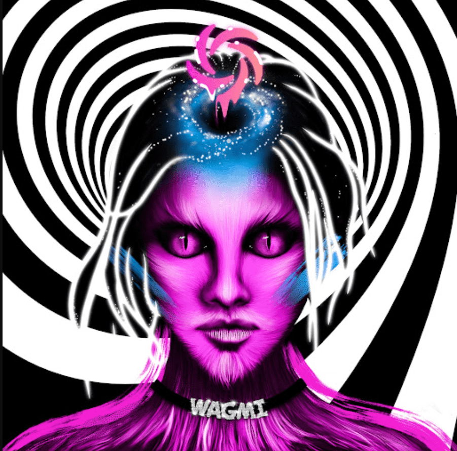

# EnterDAO Sharded Minds

EnterDAO Sharded Minds NFT - 常见问题（FAQ）
▶ 什么是 EnterDAO Sharded Minds？
EnterDAO Sharded Minds 是一个 NFT（不可替代令牌）集合。存储在区块链上的数字艺术品集合。
▶ 存在多少 EnterDAO Sharded Minds 代币？
总共有 5,000 个 EnterDAO Sharded Minds NFT。目前，1,590 名所有者的钱包中至少有一个 EnterDAO Sharded Minds NTF。
▶ 最昂贵的 EnterDAO Sharded Minds 销售是什么？
最昂贵的 EnterDAO Sharded Minds NFT 是 EnterDAO Sharded Minds #107。它于 2022-07-03（大约 2 个月前）以 164.7 美元的价格售出。
▶ 最近卖出了多少 EnterDAO Sharded Minds？
在过去的 30 天内，共有 53 个 EnterDAO Sharded Minds NFT 被售出。
▶ EnterDAO Sharded Minds 的成本是多少？
过去 30 天，EnterDAO Sharded Minds NFT 最便宜的销售额低于 28 美元，最高销售额超过 54 美元。在过去 30 天内，EnterDAO Sharded Minds NFT 的中位价格为 54 美元。
▶ 有哪些流行的 EnterDAO Sharded Minds 替代品？
许多拥有 EnterDAO Sharded Minds NFT 的用户还拥有 Polymorphs、FLUF World: Buzzies、ATEM Membership Cards 和 FLUF World: Scenes & Sounds。

