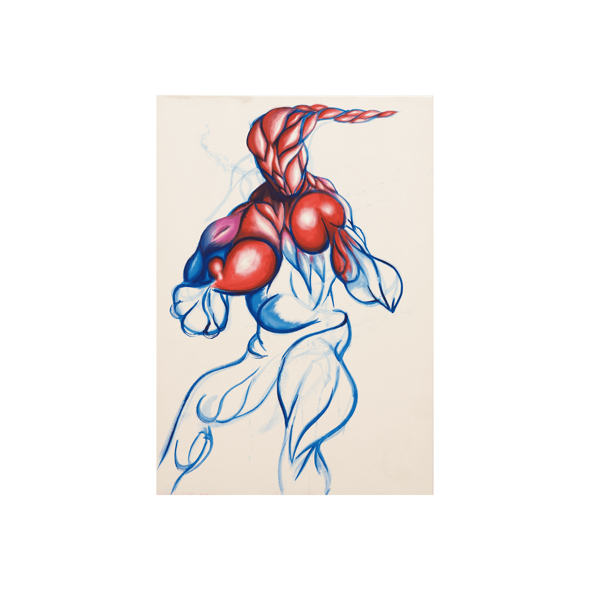

# Shards of Magnus Editions

Magnus 碎片版 NFT - 常见问题（FAQ）
▶ 什么是 Magnus 版的碎片？
Magnus 碎片碎片是一个 NFT（不可替代令牌）集合。 存储在区块链上的数字艺术品集合。
▶ 存在多少 Magnus 碎片碎片代币？
总共有 8 个 Magnus 版 NFT 碎片。 目前，58 位所有者的钱包中至少有一个 Magnus 版 NTF 碎片。
▶ Magnus 版最昂贵的碎片是什么？
出售的最昂贵的 Magnus 版 NFT 碎片是这不是一顶帽子。 它于 2022 年 6 月 16 日（3 个月前）以 343.9 美元的价格售出。
▶ 最近卖出了多少个 Magnus 碎片版？
过去 30 天内售出了 2 个 Magnus 版 NFT 碎片。
▶ Magnus 版的流行碎片有哪些替代品？
许多拥有 Magnus Shards of Magnus Editions NFT 的用户还拥有 Gunnar Magnus、ROMtoken、coupofgrace 和 [THE SICK UTILITY] 的 Heavenly Bodies。

