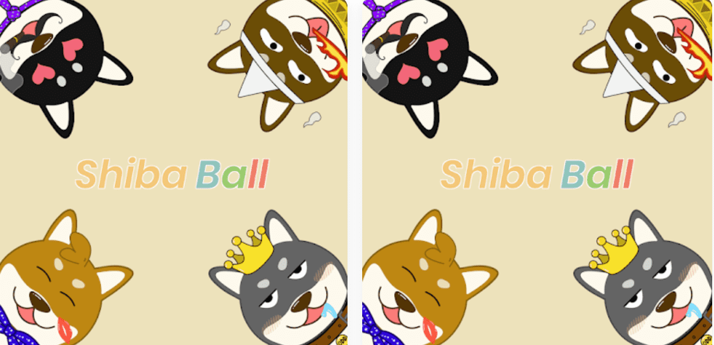

# Shiba Ball

为什么
芝球？
我们喜欢柴犬，尤其是它们圆滚滚的可爱脸蛋！因此，我们将在多边形区块链上推出总共 6,666 个独特有趣的 Shiba，等待将它们带回家并为您加油的人！
什么是
#shibaball 挑战？
为了传播 Shiba Inu 的可爱，您被邀请加入 #shibaball 挑战，通过在 Instagram 上发布您可爱的 Shiba 的故事/Twitter 帖子（标签 #shibaball）。

之后，我们将为社区突出显示的那些帖子提供 Shiba Ball NFT 赠品。元宇宙中的芝。 Shiba Ball 是在 Polygon 区块链上闲逛的 6,666 个独特有趣的 Shiba 的集合。

