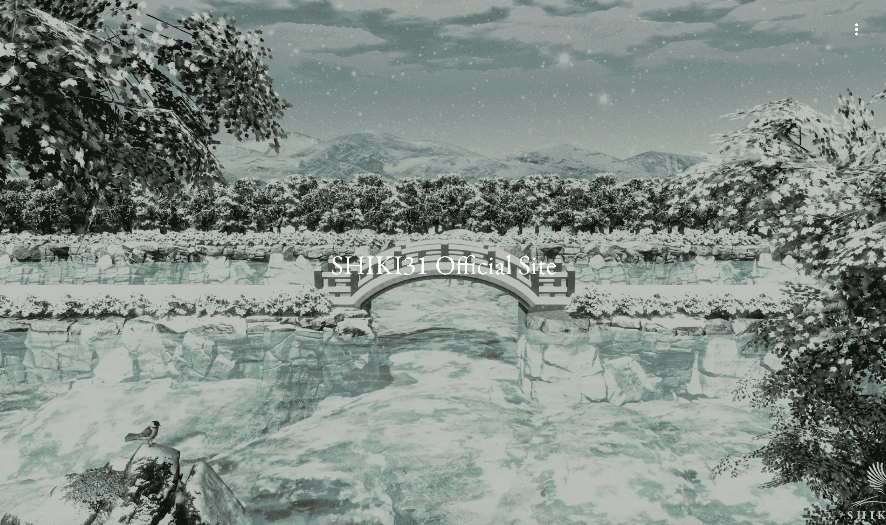

# SHIKI31

SHIKI31是一个数字艺术品牌，表达了日本四个季节、优雅、场景和传统的辉煌。 以山水画为中心，创作具有日本风情的作品，传达日本各个季节风景的品位和美感。
我们追求的不仅是数字资产，更是艺术、室内装饰、享受和治愈的品质。
品牌名称 SHIKI31 来自日文“颜色”和“四季”。
作为一家以传达日本之美为使命的公司，我们将把美丽的日语本身作为品牌名称，以“通过艺术活动为世界着色”的愿望向世界传播。

