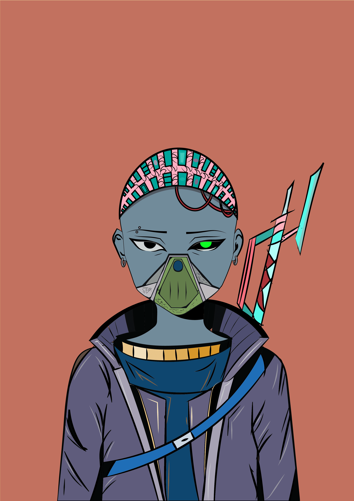

# Shines - Companions

士兵 将在战争中陪伴闪耀，虽然闪耀是天生的生物，永远不会超过邪恶，但他们需要帮助，战争力量，训练有素的士兵，注定要在即将到来的战争中勇敢战斗的同伴，同时从 第一天要做，并这样做。

这个故事始于未来，189年后的2211年。3332名女孩出生在世界不同地区。奇怪的是，生下她们的女人，前一天并不知道自己怀孕了。

所有这些都被白手起家的亿万富翁Rays博士收养，他坚信地球很快就会受到来自不同星系的文明的攻击，而这些超自然的孩子是人类生存的唯一机会。于是她为这些孩子建造了一个特殊的“家”，来抚养和训练他们，帮助他们发现自己的能力。

经过6年的训练，孩子们发现自己是4元素的士兵，这意味着他们每个人都有能力影响和控制4元素中的一种，他们是：土，火，水和空气。

现在他们已经到了11岁，这意味着他们已经准备好接受广泛的培训。今天，他们将分成四人一组。在每组中，将有一名后卫呈现其中一个元素。完成培训后，他们将准备离开他们的“家”，并在世界不同地区担任职务。

剩下的时间不多了，他们需要快点...战争即将来临。

