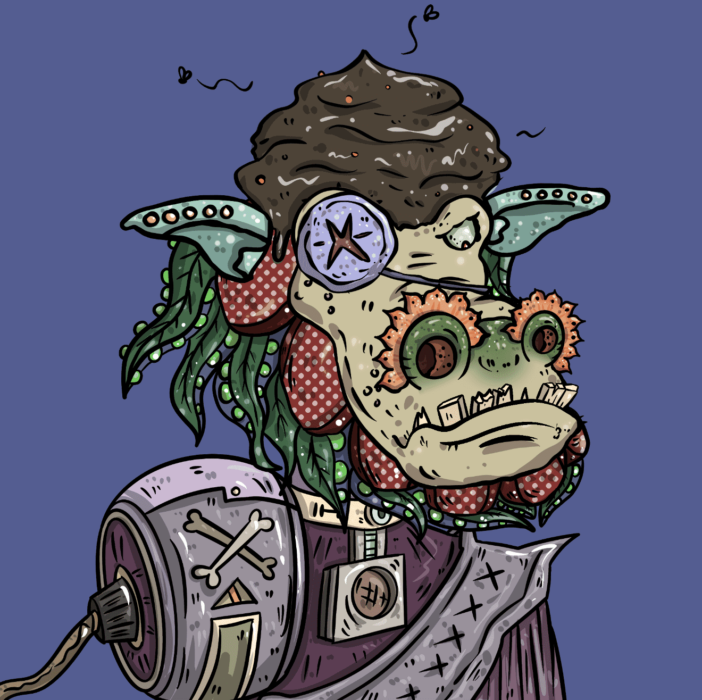

# ShitBeast

**ShitBeast 统计数据**

创建于 3 个月前，10,000 代币供应，OpenSea 验证集合，7.5% 费用

ShitBeast NFT 在过去 7 天内售出 500 次。ShitBeast 的总销售额为 16.39 万美元。一个 ShitBeast NFT 的平均价格为 327.8 美元。有 2,763 个 ShitBeast 所有者，拥有 10,000 个代币的总供应量。

ShitBeast NFT - 常见问题（FAQ）
▶ 什么是ShitBeast？
ShitBeast 是一个 NFT（不可替代令牌）集合。存储在区块链上的数字艺术品集合。
▶ 有多少个 ShitBeast 代币？
总共有 10,000 个 ShitBeast NFT。目前，2,763 名所有者的钱包中至少有一个 ShitBeast NTF。
▶ ShitBeast 最昂贵的交易是什么？
出售的最昂贵的 ShitBeast NFT 是 Genesis ShitBeast #198。它于 2022 年 6 月 13 日（3 个月前）以 2.46 万美元的价格售出。
▶ 最近卖出了多少 ShitBeast？
过去 30 天内售出了 14,201 个 ShitBeast NFT。
▶ ShitBeast 多少钱？
在过去 30 天里，ShitBeast NFT 最便宜的销售额低于 163 美元，最高销售额超过 1814 美元。过去 30 天内，ShitBeast NFT 的中位价格为 613 美元。
▶ 什么是流行的 ShitBeast 替代品？
许多拥有 ShitBeast NFT 的用户也拥有 ill poop it nft 、 Pixelverse Poops、 ShitPlunger和 NoShitZone。

