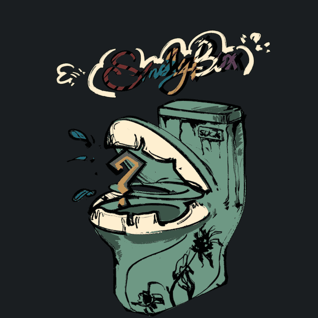

# ShitCollector

ShitCollector 是 6666 个手绘 NFT 的集合，在以太坊区块链上随机生成。我们将所有这些垃圾 NFT 冲进马桶！

ShitCollector NFT - 常见问题（FAQ）
▶ 什么是 ShitCollector？
ShitCollector 是一个 NFT（非同质代币）集合。 存储在区块链上的数字艺术品集合。
▶ 有多少个 ShitCollector 代币？
总共有 3,768 个 ShitCollector NFT。 目前，361 位所有者的钱包中至少有一个 ShitCollector NTF。
▶ ShitCollector 最昂贵的销售是什么？
售出的最昂贵的 ShitCollector NFT 是 ShitCollector。 它于 2022-06-20（2 个月前）以 7.5 美元的价格售出。
▶ 最近卖出了多少个 ShitCollector？
过去 30 天内售出了 6 个 ShitCollector NFT。

