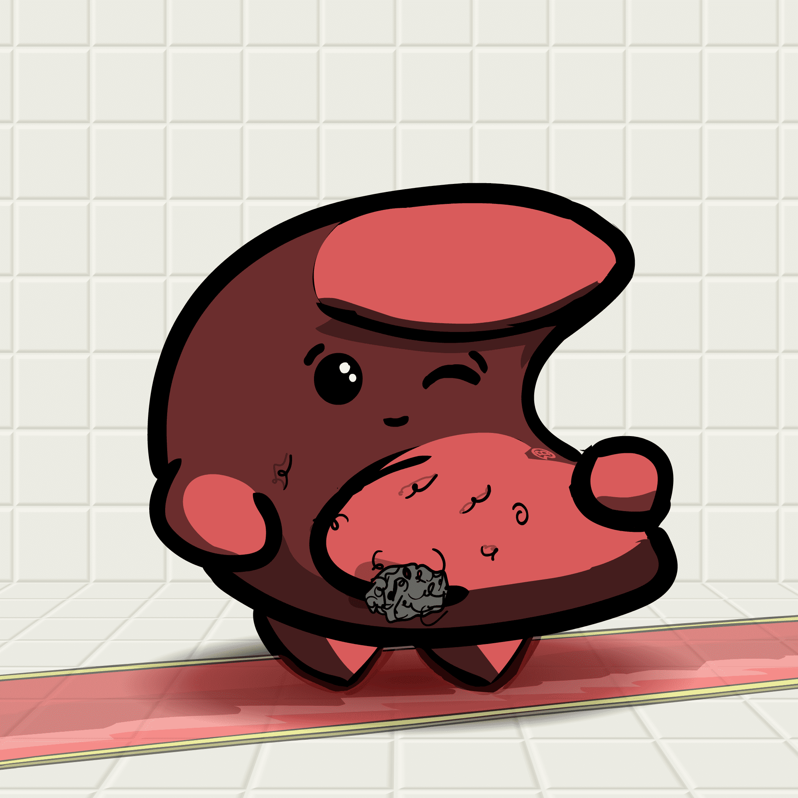

# Shitty.Investments

你们都是垃圾 NFT 收藏家，所以我们必须制作一些质量非常高的垃圾，这与你所见过的任何东西都不一样。 Shitty.investments 是为最糟糕的 NFT 投资者收集的 6,000 条狗屎。 不同的发臭、车身、配件和浮动状态。 许多超 1/1 稀有的狗屎。 毫无疑问，世界级的质量这些狗屎不会停止创新，直到只有最酷的持有并为此感到自豪。

▶ 什么是Shitty.Investments？
Shitty.Investments 是一个 NFT（非同质代币）集合。 存储在区块链上的数字艺术品集合。

▶ 有多少 Shitty.Investments 代币？
总共有 1,416 个 Shitty.Investments NFT。 目前，415 位所有者的钱包中至少有一个 Shitty.Investments NTF。

▶ 最近卖出了多少 Shitty.Investments？
过去 30 天共售出 0 个 Shitty.Investments NFT。

