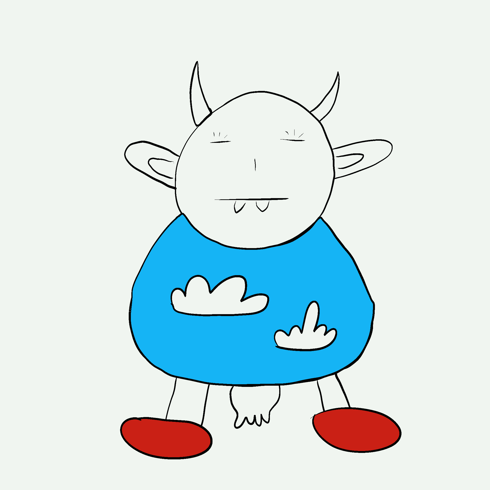

# ShittyCows

我们有不和吗？ 哞。 我们有路线图吗？ 哞。 我们有实用性吗？ 一个大他妈的Moo。 我们有烂奶牛吗？ 哞哞。

ShittyCows NFT - 常见问题（FAQ）
▶ 什么是 ShittyCows？
ShittyCows 是一个 NFT（非同质代币）集合。 存储在区块链上的数字艺术品集合。
▶ 有多少个 ShittyCows 代币？
总共有 3,333 个 ShittyCows NFT。 目前，1,103 位所有者的钱包中至少有一个 ShittyCows NTF。
▶ 最昂贵的 ShittyCows 销售是什么？
出售的最昂贵的 ShittyCows NFT 是 Shitty Cow #2943。 它于 2022-06-07（3 个月前）以 9.1 美元的价格售出。
▶ 最近卖出了多少 ShittyCows？
过去 30 天内售出了 6 个 ShittyCows NFT。

